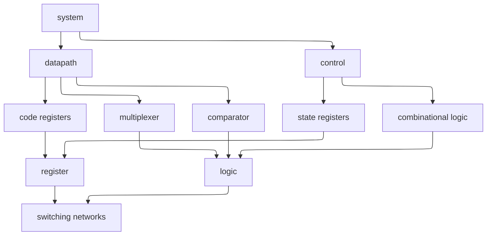

---
tags:
- CS
- ComputerStructure
---
Design Hierarchy
===

```mermaid
%%{init: {"flowchart": {"defaultRenderer": "elk"}} }%%

flowchart TD

A[system]
B[datapath]
B1[code registers]
B2[multiplexer]
B3[comparator]
C[control]
C1[state registers]
C2[combinational logic]
D1[register]
D2[logic]
E[switching networks]

A --> B
A --> C
B --> B1
B --> B2
B --> B3
C --> C1
C --> C2
B1 --> D1
B2 --> D2
B3 --> D2
C1 --> D1
C2 --> D2
D1 --> E
D2 --> E
```

