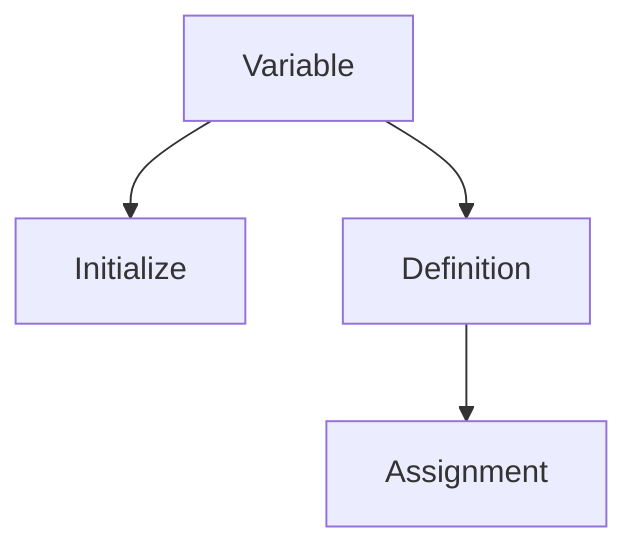

---
tags:
  - CS
  - CPP
  - CS106B
---
C++ Basic Component
===
## Comments
Comments should be used to enhance the readability of your code.
- Giving a high-level overview of any function you write whose purposes might not be immediately clear from its name.
	- Parameters
	- Output
	- Return Value
- Give high-level comments that tell what _chunks_ of code do
### Block Comment
```cpp
/* This is a comment!  
 * This is also part of the same comment!  
 * Qt Creator adds a star on each line for formatting purposes when we use this  
 * type of comment.  
Even though we don't have a star at the beginning of this line, it's still part of  
our comment!  
 * When we hit the end of this line, the star-slash causes our comment to end. */
```

### Single Line Comment
```cpp
// Comment 1
// Comment 2, No spanning lines
```
## `#include` Directives
The `include` directives import libraries of pre-written code.

Syntax:
**including standard system libraries:**
```cpp
#include < LIBRARY_NAME >
```
**including user-defined libraries:**
```cpp
#include " LIBRARY_NAME "
 ```

> The statements begin with hash `#` are *preprocessor command* or directives. This usually includes `#include` and `#define` statements, which don't need semicolons `;` to terminate the end.

## Namespaces
A namespace is a named collection of functions (and other entities) that are grouped together.
Functions called must have their namespaces given.

This resolves the problem of different library possessing the functions of the same name. Just seperate them by their namespace.
```cpp
net::createConnection();  
db::createConnection();
```

Standard C++ libraries have the namespace `std`.
```cpp
#include <iostream>

int main() {
   std::cout << "Hello, world!" << std::endl;
   return 0;
}
```
To skip specifying namespace for every function, use the `using namespace` statement.
```cpp
#include <iostream>
using namespace std;

int main() {
   // removed both occurrences of std:: below
   cout << "Hello, world!" << endl;
   return 0;
}
```

## The `main()` Function
Functions in C++ requires us to specify the **type of parameters** and the ***return type***.

Syntax for defining a function:
```cpp
DATA_TYPE FUNCTION_NAME (PARAMETERS) {
    STATEMENT(S);
}
```
- ***Code blocks*** seperated by curly braces define the *scope* of the function.
- White spaces are mostly **ignored by compiler** but good for human readable code.
- Indentation for readibility.

### Special for `main()` Function
The C++ compiler goes line-by-line through our code, starting on the first line and working its way down.

Program execution always automatically begins in `main()`. A program that doesn't have a `main()` function won't compile.
```cpp
int main() {
  statement;
  statement;
  ...
  statement;
  return 0;
}
```
The main function is a special function that inddicates the overall starting point of the program
- `main` can call other functions
- returns an integer *exit code* to the OS indicating ***exit status*** (`0` if no error else fatal error cases) as a signal for other programs

## Return Statements
Syntax for returning a value from a function:
```cpp
return EXPRESSION;
```
The `EXPRESSION` can be any expression that evaluates to the appropriate return type for our function.


## The `cout` Stream
`cout` is what we call a **stream**. By default, it acts as a direct line to our terminal. Anything we send to it with the `<<` operator gets printed to the screen.

### The `endl` String Manipulator
`endl` causes a newline character to print to the screen.

```cpp
#include <iostream>
using namespace std;

int main() {
   cout << "Hello, world!"; // Withou endl
   cout << "CS106B is awesome, and so are you!" << endl;
   cout << "switch line" << endl;
   return 0;
}
```
## Constants
***Constants***' value cannot be changed during the process of execution.
A constant **must be initialized** when it is defined and once initialized, it **cannot be assigned a new value or changed** in any way.

Syntax for defining a constant:
```cpp
const TYPE NAME = VALUE;
```
- Naming conventions: use upper case letters for constants
## Variables and Data Types
Some simple data types. See more and detailed on [[SJTU/SJTU-CS1601/Data Types]].
C++ requires us to **formally declare every variable** we want to use and **give it a specific data type** that **cannot be changed after declaration**.

| data type keyword | type description                    | example(s)                                       |
| ----------------- | ----------------------------------- | ------------------------------------------------ |
| `int`             | integer (whole number)              | `-3`, `0`, `1`, `1051`                           |
| `float`           | floating point number (real number) | `3.14159`                                        |
| `double`          | floating point number (real number) | `3.14159`                                        |
| `char`            | character (single glyph)            | `'q',` `'P'`, `'$'` (requires **single quotes**) |
| `string`          | string of characters                | `"Hello, world!"` (requires **double quotes**)   |
| `bool`            | Boolean                             | `true`, `false` (no quotes)                      |

A **variable declaration** is a statement wherein we bring a new variable into existence and give it a data type.
Declaration gives the following properties of a variable:
- Name
- Type
- Lifetime
- Scope

The syntax for that in C++ is:
```cpp
DATA_TYPE VARIABLE_NAME;
```


Common practice for a variable:


- ***Definition*** (without initial value)
- ***Assignment*** (give it a new value)
- ***Initialization*** (with a initial value)

Syntax for initialization:
```cpp
DATA_TYPE VARIABLE_NAME = VALUE;
DATA_TYPE VARIABLE_NAME(VALUE);
```

### Identifiers
The names used for variables, functions, types, constants, etc are known as ***identifiers***.
Rules for identifier formation:
- The name must start with `[a-zA-Z_]`
- The rest can contain only `[a-zA-Z0-9_]`
- Not in the C++ keywords


### Common Pitfall with Variables
- Undeclared variable
- Type mismatch
- Attempting to change a variable's data type
- Redefinition of variables

### Uninitialized Variables
In C++, variables are not automatically initialized. By default, if you don't assign a value to a variable, it contains garbage.


## While Loops
Syntax:
```cpp
while (CONDITION) {
  STATEMENT(S)
}
```

Example:
```cpp
#include <iostream>
using namespace std;

int main() {
   int i = 1;

   while (i < 5) {
      cout << i << endl;
      i++;
   }

   return 0;
}
```
### The `++` Operator
See more on [[Increment Decrement Operators]]
## For Loops
Syntax:
```cpp
for (INITIALIZATION_STATEMENT); CONDITION; POST_ITERATION_STATEMENT) {
  STATEMENT(S)
}
```
- Initialize statement: executed once
- Condition: evaluated before kicking off an iteration
- Post-incrementation statement: executed at the end of each iteration

Example:
```cpp
#include <iostream>
using namespace std;

int main() {
   for (int i = 1; i < 5; i++) {
      cout << i << endl;
   }

   return 0;
}
```
## For-Each Loops (Range-Based Loops)
Iterate through all of the elements in a container.

Syntax:
```cpp
for (DATA_TYPE VARIABLE_NAME : CONTAINER) {
    STATEMENT(S) 
}
```

Example:
```cpp
#include <iostream>
using namespace std;

int main() {
   string s = "giraffe";

   // Initially, ch is set equal to the first character in s. With each subsequent
   // iteration of the loop, ch moves forward by one character in the string.
   for (char ch : s) {
      cout << ch << endl;
   }

   return 0;
}
```


## Conditional (If-Else) Statements
Syntax:
```cpp
if (CONDITION) {
  STATEMENT(S)
} else if (CONDITION) {
  STATEMENT(S)
} else {
  STATEMENT(S)
}
```
- One `if`
- Zero or more `else if`
- Zero or one `else`

## Comparision operators

| operator | meaning                  |
| -------- | ------------------------ |
| `<`      | less than                |
| `<=`     | less than or equal to    |
| `>`      | greater than             |
| `>=`     | greater than or equal to |
| `==`     | equal to                 |
| `!=`     | not equal to             |


## Boolean Opeators

| operator | meaning       |
| -------- | ------------- |
| !        | Boolean "NOT" |
| &&       | Boolean "AND" |
| \|\|     | Boolean "OR"  |
### NOT
A *compound expression* needs to be warped up by prentheses in order to be negated by `!`.
This is because of [[Operator Precedence]].


### AND and OR
Binary operators in C++ are ***short circuit operators***.
```cpp
<left> && <right>;
<left> || <right>;
```
- False values in C++: `0`, `false`
- True values in C++: everything else
#### `&&`
1. Evaluate the subexpr `<left>`
2. If the result is a false value `v`, ==then== the expression evaluates to `v`
3. Otherwise, the expression evaluates to `<right>`
#### `||`
1. Evaluate `<left>`
2. If the result is a false value `v`, then the expression evaluates to `v`
3. Otherwise, the expression evaluates to `<right>`
##### Common Pitfalls
The following always evaluates to `true`:
```cpp
(numCupcakes == 1 || 2)
```
Use `||` twice
```cpp
(numCupcakes == 1 || numCupcakes == 2)
```

