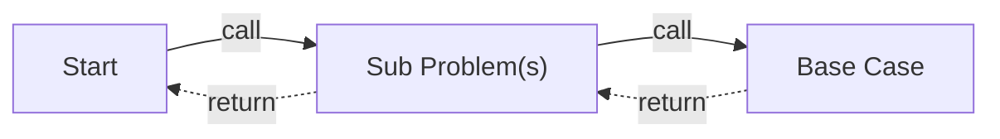

---
tags:
  - CS
  - CPP
  - CS106B
---
Recursion
===
The general idea has been given by CS61A.

## Examples
### Example: Palindromes
```cpp
#include <iostream>
using namespace std;

bool isPalindrome(string s) {
  // All strings of length 1 are palindromes, as is the empty string.
  if (s.length() <= 1) {
     return true;
  }

  if (s[0] != s[s.length() - 1]) {
     return false;
  }

   // Peel off the first and last character and pass the remaining string
   // to isPalindrome() recursively. We needn't use a new string variable
   // here. I did that in class only to clarify what was going on. The
   // more conventional approach is to pass s.substr(...) to isPalindrome()
   // directly.
  string sub = s.substr(1, s.length() - 2);
  return isPalindrome(sub);
}

int main() {
  string a = "step no on pets";
  cout << isPalindrome(a) << endl;
  return 0;
}
```

### Example: Reverse String Printing
```cpp
void printStringReverse(string s) {
  if (s.length() == 0) {
    cout << endl;
    return;
  }

  cout << s[s.length() - 1];
  printStringReverse(s.substr(0, s.length() - 1));
}
```
Or let the recursive problem stack handle the order:
```cpp
#include <iostream>
using namespace std;

void printStringReverse(string s) {
  if (s.length() == 0) {
    cout << endl; // This is problematic.
    return;
  }

  // Swapped order of lines below.
  printStringReverse(s.substr(1));
  cout << s[0];
}

int main() {
  // Calling twice to ensure proper placement of line break in output.
  printStringReverse("hello");
  printStringReverse("hello");

  return 0;
}
```
> This will output a `/n` before outputting the result.
> Resolved by ***warpper function***:
> >A function that acts as a sort of gateway to our core function, but takes care of any setup or tear-down that needs to happen before or after that core function is executed.

```cpp
#include <iostream>
using namespace std;

void printStringReverseHelper(string s) {
  if (s.length() == 0) {
    return;
  }

  printStringReverseHelper(s.substr(1));
  cout << s[0];
}

void printStringReverse(string s) {
  printStringReverseHelper(s);
  cout << endl;
}

int main() {
  // Calling twice to ensure proper placement of line break in output.
  printStringReverse("hello");
  printStringReverse("hello");

  return 0;
}
```

