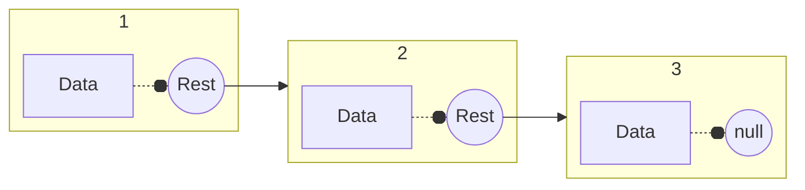
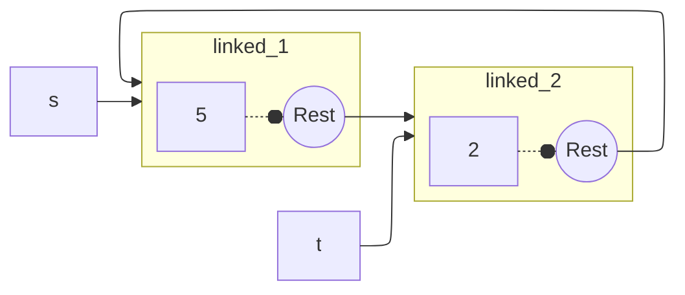

---
tags:
  - CS
  - Python
  - CS61A
---
Linked Lists
===
A linked list is either empty or a first value and the rest of the linked list.

## Linked List Class
We use object system to implement linked lists in Python
```python
class Link:
    empty = ()
    
    def __init__(self, first, rest=empty):
        assert rest is Link.empty or isinstance(rest, Link)
        self.first = first
        self.rest = rest
    def __getitem__(self, i):
        if i == 0:
            return self.first
        else:
            return self.rest[i-1]
    def __len__(self):
        return 1 + len(self.rest)
    
    def __repr__(self):
        if self.rest is self.empty:
            rest = ''
        else:
            rest = ', ' + repr(self.rest)
        return f'Link({self.first}{rest})'
        

s = Link(3, Link(4, Link(5)))
>>> def join_link(s, separator):
        if s is Link.empty:
            return ""
        elif s.rest is Link.empty:
            return str(s.first)
        else:
            return str(s.first) + separator + join_link(s.rest, separator)
>>> join_link(s, ", ")
'3, 4, 5'
```

- For `__len__`, the base case is reached when self.rest evaluates to the empty tuple, `Link.empty`, which has a length of 0.
## Processing
```python
def range_link(begin, end):
    """Return a Link containing consecutive integers from start to end.
    
    >>> range_lilnk(3, 6)
    Link(3, Link(4, Link(5)))
    """
    if start >= end:
        return List.empty
    else:
        return Link(start, range_link(start+1, end))


def map_link(f, s):
    """Return a Link contains f(x) for each x in Link s.
    
    >>> map_link(square, range_link(3, 6))
    Link(9, Link(16, Link(25)))
    """
    if s is Link.empty:
        return s
    else:
        return Link(f(s.first), map_link(f, s.rest))


def filter_link(f, s):
    """Return a Link that contains only the elements of x of Links s for which f(x) is a true value.
    
    >>> filter_link(odd, range_link(3, 6))
    Link(3, Link(5))
    """
    if s is Link.empty:
        return s
    filtered_rest = filter_link(f, s.rest)
    if f(s.first):
	    return Link(s.first, filtered_rest)
	else:
	    return filtered_rest
```

## Mutating
Linked list object instance can be mutated through mutating `List.first` and `List.rest`.

The rest of a linked list can contain the linked list as a sub-list.
Do not mutate directly the `List`, which might leads to recursive definition.
```python
s = Link(1, Link(2, Link(3)))
s.first = 5
t = s.rest
t.rest = s # It is mutating s because t.rest is s.rest.rest
```

To copy a linked list, use `Link(List.first, List.rest)`