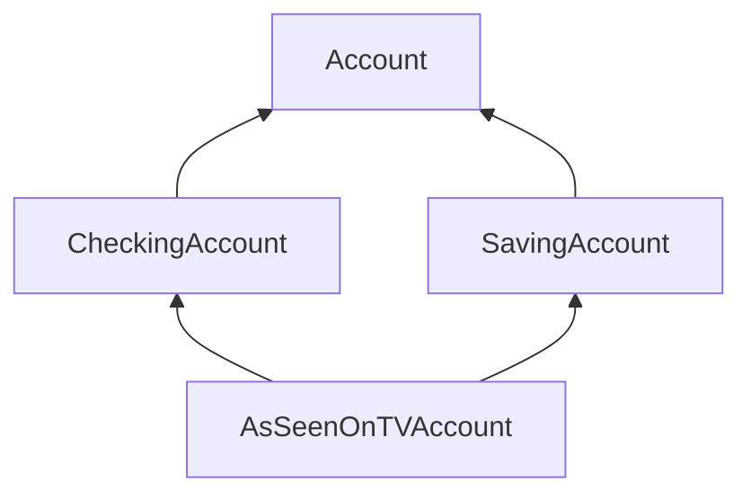

---
tags:
  - CS
  - Python
  - CS61A
---
Object-Oriented Programming
===
## Inheritance
Class can have subclasses and a base class.
```python
class Base:
	<suite>
class Sub(Base):
	<suite>
```
The subclass inherites all of the attributes of its base class, while maybe *overriding* some of them and adding several class attributes.
Inherited classes *is-a* special type of its base class, rather than being in a *has-a* relationship.

Base class attributes aren't copied into subclasses. They are looked up.
To look up a name in a class:
1. If it names an attribute in the class, return the attribute value.
2. Otherwise, look up the name in the base class, if there is one.
- Sum up: Instance <- Class <- Base Class

### Calling Ancestors
Principle: Don't repeat yourself; use existing implementations by **calling ancestors**
```python
class Account:
	def __init__(self, account_holder):
		self.balance = 0
		self.holder = account_holder
	def deposit(self, amount):
		self.balance += amount
		return self.balance
	def withdraw(self, amount):
		if amount > self.balance:
			return "Insufficient!"
		self.balance -= amount
		return self.balance

class CheckingAccount(Account):
	interest = 0.01 # Override the Account.interest
	fee = 1
	def withdraw(amount):
		return Account.withdraw(self, amount + self.fee) # Do not copy code
```
Attributes that have been overridden are still accessable via class objects.
- Overridding: Giving an attribute the same name as exists in the base class
```python
>>> CheckingAccount.interest
0.01
>>> Account.interest
0.04
```
Note that `self` is more preferable due to the consideration of reusability, if we want to implement a subclass of `CheckingAccount` and call its `CheckingAccount.withdraw` which have a different `fee`
#### `super()`
Shorthand for Calling the Base Classes' Method
```python
class Base:
	def foo(example=1):
		return example
class Sub(Base):
	def foo(example=3):
		return super().foo(example) # Calling Base.foo on default value 3 rather than 1
```
## Multiple Inheritance
A subclass inheriting attributes from multiple base classes, a language feature called _multiple inheritance_.
```python
class SavingsAccount(Account):
    deposit_charge = 2
    def deposit(self, amount):
        return Account.deposit(self, amount - self.deposit_charge)

class AsSeenOnTVAccount(CheckingAccount, SavingsAccount):
    def __init__(self, account_holder):
        self.holder = account_holder
        self.balance = 1
```
The `AsSeenOnTVAccount` class is inherited from both `CheckingAccount` and `SavingsAccount`, so it possess the attribute and methods of both of them.

For non-ambiguous references, this works just fine.
```python
>>> such_a_deal = AsSeenOnTVAccount("John")
>>> such_a_deal.deposit_charge
2
>>> such_a_deal.withdraw_charge
```

For ambiguous references, which there might be cases that the inherited classes have methods of the same name but behave differently, Python follows an *inheritance graph*:

Python resolves names from left to right, then upwards.
Python checks for an attribute name in the following classes, in order, until an attribute with that name is found:
`AsSeenOnTVAccount, CheckingAccount, SavingsAccount, Account, object`

The method resolution order of classes of the same hierarchical level is confusing, but follows a certain consistent pattern.
To look up the method resolution order, use the `mro` method to query it on all classes
```python
>>> [c.__name__ for c in AsSeenOnTVAccount.mro()]
['AsSeenOnTVAccount', 'CheckingAccount', 'SavingsAccount', 'Account', 'object']
```

