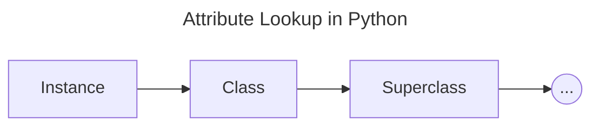

---
tags:
  - CS
  - Python
  - CS61A
---
Objects
===
## Attributes and Methods
Objects have attributes
Methods are attributes bound to a function
```python
>>> someObject.attribute
someReturnValue
>>> someObject.method(parameters)
someOtherReturnValue
```
## Classes
A class serves as a template for all objects whose type is that class. Every object is an instance of some particular class.
Defining a class uses a single clause
```python
class <name>:
	<suite>
```
The suite is executed when the class statement is executed.

When a class is called:
1. A new instance of that class is created.
2. The `__init__` method of the class is called with the new object as its first argument (named `self`), along with any additional arguments provided in the call expression.

```python
class Account:
	def __init__(self, account_holder): # SELF is bounded to the object instance
		self.balance = 0 # Assigning attribute values
		self.holder = account_holder
a = Account('Jim')
```

- `__init__` is called a constructor
	- Whenever the `class` is called, `__init__` is called with its arguments
	- This makes instance attributes
- `self` is referred to a **particular instance** of the class `Account`
	- It's just a naming convention
## Object Representation
See [[String Representation]]
## Object Identity
Every object that is an instance of a user-defined class has a unique identity.
Every call to a class creates a new class instance

## Methods
Methods are defined in the suite of a class statement.
```python
class Account:
	def __init__(self, account_holder): # SELF is bounded to the object instance
		self.balance = 0 # Assigning attribute values
		self.holder = account_holder
	def deposit(self, amount):
		self.balance += amount
		return self.balance
	def withdraw(self, amount):
		if amount > self.balance:
			return "Insufficient!"
		self.balance -= amount
		return self.balance
```
### Invoking Methods
All invoked methods have access to the object via the `self` parameter, and so they can all access and manipulate the object's state.

Dot notation automatically supplies the first argument to a method. It supplies the object instance that we're invoking on.
```python
>>> tomAccount = Account('Tom')
>>> tomAccount.deposit(100)
100
```
### Dot Expressions
Object receive messages via dot notation.
Dot notation access attributes of the instance or its class.
```python
<expression>.<name>
```
- The `<expression>` can be any valid Python expression.
- The `<name>` must be a single name.

Evaluates to the value of the attribute **looked up** by `<name>` in the object that is the value of the `<expression>`
- Is the `<name>` bound to the object?
- If not, is the `<name>` bound to the class?

### Methods and Functions
Bound methods couple together a function and the object on which that method will be invoked.
The object will be passed in as the first argument of the method as a function

<p align="center">Object + Function = Bound Methods</p>

```python
>>> Account.deposit(tom_account, 1000)
1000
>>> tom_account.deposit(1000)
2000
>>> type(Account.deposit)
<class 'function'>
>>> type(tom_account.deposit)
<class 'method'>
```
These has the same effect.
## Attributes
Attributes are data stored within either an instance or the class.

### Accessing Attributes
- `getattr(name, 'attribute')`
	- Equivalent to `name.attribute`
- `hasattr(name, 'attribute')`
	- Return `True` if
		- The instance `name` has attribute `attribute`
		- The class has attribute `attribute`

### Looking Up Attributes by Name
Evaluating a dot expression `<expression>.<name>`:
1. Evaluate the `<expression>` to the left of the dot, which yields the object of the dot expression.
2. `<name>` is matched against the instance attributes of that object; **if an atttribute with that name exists**, its value is returned.
3. If not, `<name>` is looked up in the class, which yields a class attribute value.
4. That value is returned unless it is a function, in which case a *bound method* is returned instead.
### Class Attributes
Class attributes are "shared" across all instances of a class.

Class attributes can be looked up if the instance attribute is not found.


### Assignment to Attributes
Assignment statements with a dot expression on their left-hand side affect attributes for the object of that dot expression
- If the object is an instance, then assignment sets an instance attribute
- If the object is a class, then assign sets a class attribute
```python
Account.interest = 0.04 # Class Attribute
tom_account.interest = 0.06 # Instance Attribute
```


