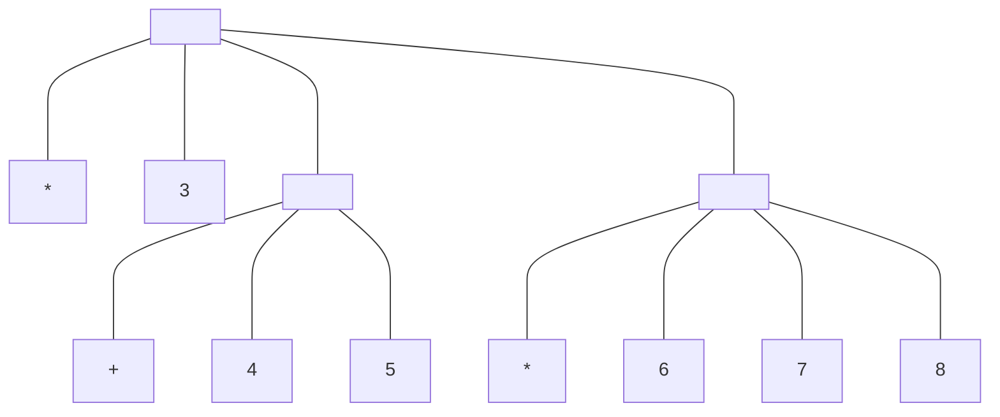

---
tags:
  - CS
  - Programing
  - CS61A
---
Calculator
===
## Expression Trees
```scheme
(* 3
   (+ 4 5)
   (* 6 7 8))
```

### Scheme Pairs
The `Pair` class and `nil` object are Scheme values represented in Python.
They have `repr` strings that are Python expressions and `str` strings that are Scheme expressions.
```python
# scheme_reader.py
>>> s = Pair(1, Pair(2, nil))
>>> s
Pair(1, Pair(2, nil))
>>> print(s)
(1 2)
```
### Nested Lists
Elements of a list can also be lists themselves.
Pairs can represent Scheme expressions, which are in fact nested lists.
```python
# scheme_reader.py
>>> expr = Pair('+', Pair(Pair('*', Pair(3, Pair(4, nil))), Pair(5, nil)))
>>> print(expr)
(+ (* 3 4) 5)
>>> print(expr.second.first)
(* 3 4)
>>> expr.second.first.second.first
3
```
All Calculator expressions are nested Scheme lists.

## Parsing Expressions
Parsing is the process of generating expression trees from raw text input.
Composition:
- Lexical analyzer
- Syntactic analyzer

Parsing procedure:
1. The *lexical analyzer* partitions the input string into *tokens*
	- Tokens: Minimal syntactic units of the language such as name and symbols
2. The *syntactic analyzer* constructs an expression tree from this sequence of tokens
	- Sequence of tokens is consumed

### Lexical Analysis
A *tokenizer* or *lexical analyzer* interprets a string as a token sequence.
- Scheme tokens are delimited by white space, parentheses, dots, or single quotation marks
- Delimiters are tokens, as are symbols and numerals
```python
# scheme_tokens.py
>>> tokenize_line('(+ 1 (* 2.3 45))')
['(', '+', 1, '(', '*', 2.3, 45, ')', ')']
```
- Iterative process
- Separates all symbols and delimiters
- Checks for malformed tokens
- Determines types of tokens
	- Identifies multi-character numbers (e.g., 2.3) and converts them into numeric types
- Process one line at a time

### Syntactic Analysis
A *syntactic analyzer* interprets a token sequence as an expression tree.
It identifies the hierarchical structure of an expression
```python
# scheme_reader.py
>>> lines = ['(+ 1', '   (* 2.3 45))']
>>> expression = scheme_read(Buffer(tokenize_lines(lines)))
>>> expression
Pair('+', Pair(1, Pair(Pair('*', Pair(2.3, Pair(45, nil))), nil)))
>>> print(expression)
(+ 1 (* 2.3 45))
```
- Tree-recursive process
	- Analyzing subsequences into a subexpression
- Balances parantheses
- Returns tree structure
- Processes multiple lines

**Base case**: symbols and numbers
**Recursive call**: `scheme_read` sub-expressions and combine them
## Calculator Language
The Calculator language has primitive expressions and call expressions.
- Primitive expressions are numbers
- Call expressions are combinations that begins with an operator (`+, -, *, /`) followed by 0 or more expressions

Expressions are represented as Scheme lists (Pair instances) that encode tree structures.
### Semantics
The value of a calculator expression is defined recursively
**Primitive**: A number evaluates to iteslf
**Call**: A call expression evaluates to its argument values combined by an operator
- `+` Sum of the arguments
- `*` Product of the arguments
- `-` 
	- If one argument, negate it
	- If more than one, subtract the rest from the first
- `/`
	- If one argument, invert it
	- If more than one, divide the rest from the first
## Evaluation


### Read-eval-print Loops (REPL)


```python
def read_eval_print_loop():
    """Run a read-eval-print loop for calculator."""
    while True:
        src = buffer_input()
        while src.more_on_line:
            expression = scheme_read(src)
            print(calc_eval(expression))
```

Use a `try`statement to implement *termination* and *error handling*:
- Keyboard interrupt `<c-c>`
- EOL exception `<c-d>`

```python
def read_eval_print_loop():
    """Run a read-eval-print loop for calculator."""
    while True:
        src = buffer_input()
        while src.more_on_line:
            expression = scheme_read(src)
            print(calc_eval(expression))
        except (SyntaxError, TypeError, ValueError, ZeroDivisionError) as err:
            print(type(err).__name__ + ':', err)
        except (KeyboardInterrupt, EOFError):  # <Control>-D, etc.
            print('Calculation completed.')
            return
```
