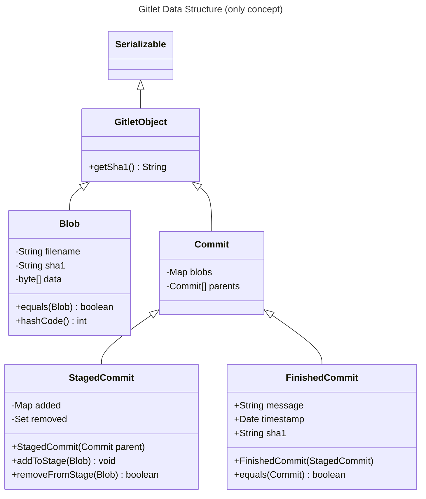
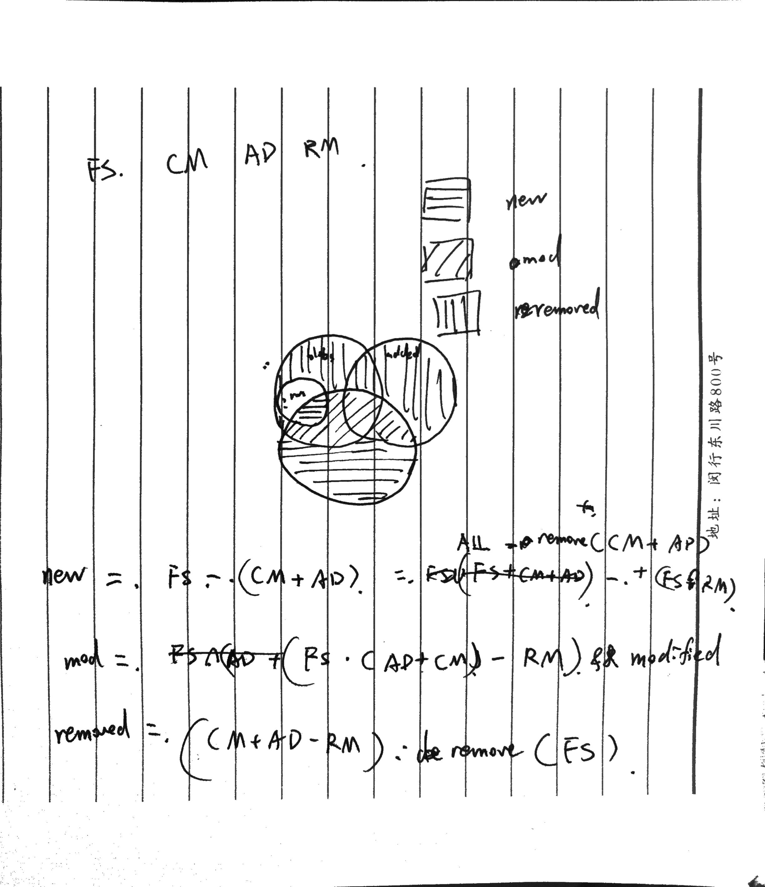
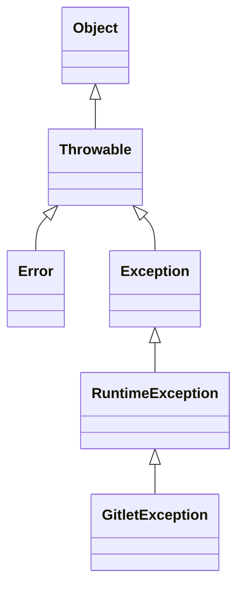

Project 2 Gitlet Design Doc
===
## Overview on Git and Preview on Gitlet
Topics over this project:
- Maps.
- Hashing.
- File I/O.
- Graphs.

### Git Functionality Model
How git works:

- Every time changes are committed to a file, git stores a copy of the entire repository in `.git/`
- Using algorithm to avoid redundancy


Approaches of commiting:
1. ~~Make a whole copy of all files for each version~~
2. Only store files that change
	- GOOD: efficient, avoid storing redundancy
	- BAD: Checkout is complicated, have to copy file from different folders, walk throught from begining
3. Approach 2 but data structure
   Store a list of "commits", each commit tells `filename: version` K, V pair for the files in that commit
	- e.g. 
	  ```
	  Commits:
      V1: Hello.java → v1
      V2: Hello.java → v2, Friend.java → v2
      V3: Hello.java → v2, Friend.java → v2, Egg.java → v3
      V4: Hello.java → v2, Friend.java → v4, Egg.java → v3
      V5: Hello.java → v5, Friend.java → v4, Egg.java → v3
      
      Files:
      .git/v1/Hello.java
      
      .git/v2/Hello.java
      .git/v2/Friend.java
      
      .git/v3/Friend.java
      .git/v3/Egg.java
      
      .git/v4/Friend.java
      
      .git/v5/Hello.java
      ```
	- When file are the same between versions, only store one copy
4. Use **Hashing** as version number
	- Git uses **git-SHA1 hash** of a file as its version number
		- The [SHA1](https://en.wikipedia.org/wiki/SHA-1) hash of (file size + a zero + the file contents).
	- The git-SHA1 hash is a **deterministic** function of the file’s contents.
		- Two identical files will always have the same git-SHA1 hash.
		- git-SHA1 hash is 160 bits long.
	- Procedure
		1. First, git computes the git-SHA1 hash:
			- `HelloWorld.java` -> `66ccdc645c9d156d5c796dbe6ed768430c1562a2`
		2. Git creates a folder called `.git/objects/66`
			- The 66 is the first two characters of the git-SHA1 hash.
		3. Git stores the contents in a file called `ccdc645c9d156d5c796dbe6ed768430c1562a2`.
			- File is stored in a compressed format (zlib) to save space.

Additional benefit of SHA1-Hashing: **Verify file integrity**

### Git Commits
Every commit in git stores (at least):
- An author.
- A date.
- A commit message.
- A list of all files and their versions.
	- Versions are git-SHA1 hashes.
- The parent’s commit ID.
	- Example: aa45f...db’s parent ID is d1bd...61.

Git commit IDs are files containing the above message, and use git-SHA1 to hash it as filename.

To store an object as a file, we can implement the class as a `Serializable`
```java
public class Commit implements Serializable {
   public String author;
   public String date;
   public String commitMessage;
   public String parentID;
   ...
}
```


### Git Merging
Commits are a more general structure called a **graph**

When merging, there can be **merge conflicts**: when both commits try to edit the same part of the file
```diff git diff
public class Cheese {
     ...
}
<<<<<<< HEAD
- asdfasdf
- 
- public Cheese Parmesan {
-     ...
- }
=======
+
+ public Cheese Swiss {
+     ...
+ }
>>>>>>> Swiss
```

After merge completes, one commit have two parents.
```git
*   faff9d1 (HEAD, master) resolve merge
|\  
| * 33c7a92 (WithSwiss) added swiss
* | 2720092 fixed parm
* | 7e41ce1 added parmesan
|/
* aa45fbd fixed cheese bug
* d1bde19 version 1 of my code
```

### Objects in Git
- **_blobs_**: The saved contents of files. Since Gitlet saves many versions of files, a single file might correspond to multiple blobs: each being tracked in a different commit.
- **_trees_**: Directory structures mapping names to references to blobs and other trees (subdirectories).
- **_commits_**: Combinations of log messages, other metadata (commit date, author, etc.), a reference to a tree, and references to parent commits. The repository also maintains a mapping from _branch heads_ to references to commits, so that certain important commits have symbolic names.


Each commit (rectangle) points to some blobs (circles), which contain file contents. The commits contain the file names and references to these blobs, as well as a parent link.


## Design

### Gitlet Objects Explained
The following are merely the concept of data structures used in this project. The current implementation of `Commit` is using a rather plain structure and doesn't involve inheritance.


#### Blobs

Blobs are gitlet's internal representation of a file object. The fields are stated above.

All blobs are uniquely identified by their sha1 hash. In my implementation, there're three data that are indexed into this hash: file size (`int`), file data (`byte[]`) and filename (`String`). If two blobs have the same sha1, they are considered the same. Therefore, the `hashCode` of a blob is `sha1.hashCode`.

In real git, the sha1 hash is only determined by the previous two fields. The introduction of filename is to resolve such problem in the process of development: 

> Alright, BIG PROBLEM: If a file is renamed but content not changed, or there's simply a copy of file file with different name, the system view it as a hash collasion.
> 
> Solution: Add filename to blob.

This isn't a perfect solution, because renaming a file obviously doesn't change the content of a file. In real life, hashing are used for "checksum" during the process of data transfering. Two copies of data are considered the same if only they have the same content, so **hashing should also be determinant ONLY of the content**. In gitlet, for simplicity I included the filename as also a part of the content. This is reasonable for the internal representation for a blob object, but not suitable and intuitive for real life situations.


### Internal Structure of Blobs and Commits


***
Another problem: The `global-log` is difficult to maintain for removed branches

Need to improve file structure: In objects, differentiate between blobs and commits


### Gitlet Directory Explained
The following shows all necessary files for a gitlet workspace.

```
.gitlet
├── HEAD
├── staged
├── logs
│   ├ HEAD (copy of current head)
│   └ refs
│     └ heads
│       ├ master
│       └ ...
├── refs
│   └ heads
│     ├ master
│     └ ...
└── objects
    └ ...

```

#### `.gitlet/HEAD`

This file contains the relative path to the current branch. A typical content is

```txt
refs/heads/master
```

In `Repository.java`, this file is described as `ROOT_HEAD_FILE`.

Related methods:
- `getCurrentBranch` - Get the branch name of current branch
- `updateRootHead` - Update the file with new branch name (when there's a branch switch)

####  `.gitlet/staged`

This file is the serialized `staged` commit. It contains all the changes to the current working directory that are **staged** but not yet **committed**.

In `Repository.java`, this file is described as `STAGE_FILE`.

#### `.gitlet/refs/`

This directory contains a list of reference files, **named after branch names**, which contains the sha1 reference of the commits they are pointed to.

A typical file content in this directory is
```
<40-bit long sha1 hash of a commit object>
```

The `heads/` subdirectory contains reference files that are named after branches of **local** workspace, and remote repositories should be considered added into `remotes/`.

In `Repository.java`, the directory is described as `REFS_DIR`, and the `./heads` is described as `REFS_HEADS_DIR`.

Related methods:
- `getHeadCommit` + Gets the Commit object referenced by the content (sha1) of a certain file in `.gitlet/refs/heads`
- `getBranches` + Get a list of all branches (filenames)
- `read/writeCommitRef` - Get/Update the content of a reference file


#### `.gitlet/logs`

This directory contains commit logs that are made during the growth of the commit tree.

- `.gitlet/logs/HEAD` The commit log of the current branch
- `.gitlet/logs/refs/heads/` The commit logs of all branches in the local repository, named after branch name
- `.gitlet/logs/refs/removed` The commit logs of all removed branches

A typical content of a log file looks like
```
2ce65f5a579f3c17fd96c9d2c864963e3b390b6c ff996b889687145ca3f3a94f412d7b7aa44a0d40 1727506906914 Add h.txt
ff996b889687145ca3f3a94f412d7b7aa44a0d40 15cd047907d2ec894289449420354323dc832925 1727506907881 Merged C1 into B1.
15cd047907d2ec894289449420354323dc832925 40ceb5b81ff9addc1209634d0187d3704f1a736e 1727506908023 Merged B2 into B1.
```

From left to right, separated by white space:
- Sha1 reference of parent commit
- Sha1 reference of current commit
- Commit timestamp
- Commit message

The file whose name is in accordance with the branch in `logs/refs/heads/` should be updated whenever a commit is maded to that branch. Also the `logs/HEAD` should be copy modified when there's a branch switch, or a commit to current branch.

When a branch is removed, all of it's log should be moved and concatnated to `logs/refs/removed`.


### About Unstaged Changes and Destructive Commands

In the design of Gitlet, there're several commands that should be aborted when there is an unstaged change **that would be overwritten** by the command.

- `reset`
- `checkout`
- `merge`

Further more, when using `gitlet status`, the command should be able to print out all unstaged changes in the CWD. (This is an extra point.)


Initially, I use the method `Commit.hasUnstaged` to test whether there's any unstaged changes in the CWD, comparing the files in CWD to the staged commit. The `Commit.getUnstaged` use the same code, but will return a `SortedMap` of unstaged changes and their reason of being unstaged.

This turns out to be inefficient, and does not meet the requirement of the project, that is, according to the specs, "abort when the unstaged change would be **overwritten**". The usage of `hasUnstaged` however, will about anyway even if this change wouldn't be overwritten.

Below is the explaination of the algorithm. It is still used in printing out all unstaged changes.


At this point I decided to design a new function `testUnstaged`. This function should be called individually when a file need to be checked whether it has unstaged changes, and throws exception when it does.


Throwing the exception during the modification of the working directory is also the problem: The handling of `UnstagedException` (and other unintended exceptions such as `IOException`) should involves **restoring the previous workspace**.

It is very common when you have to do some destructive changes to the files but an exception is in the way. Therefore I also written `snapshotWorkspace` and `restoreWorkspace`, which should be basically used in pair.
This guarantees the destructive commands won't break the workspace when exception occurs.


> [!tip] Best practice
> Restore changes in error handling if the operation is to be aborted.

> [!BUG] FIXME
> The new `testUnstaged` and `restoreWorkspace` workflow is not working on `reset`. Currently it is still testing whether there're unstaged changes and throws error before everything else.

#### `restoreToCommit`
Used in `checkout [branch]` and `reset`.

This method throws `UnstagedException` when it encounters an unstaged change through the test of `testUnstaged`, and the caller should be able to handle by restoring to the state before.


### Add
![[GitletAdd.svg]]


It looks rather complicated, but currently these logics are processed in instance methods `add` and `remove` in `Commit`, so it doesn't look quite scary.

The logic for adding a non-existent file is mocking the real git, and is not required in gitlet.


### Remove

![[Gitlet Remove.svg]]

### Merge

#### Finding Closest Common Ancestor

The first step to merging is to find the closest common ancestor between two commits.

Finding the closest common ancestors involves graph traversal.

We first get a HashSet of all ancestors of a given branch. This uses DFS:
```java
private static HashSet<Commit> getAllAncestors(String branch) {
	// Get the starting point
	Commit head = getHeadCommit(branch);
	Hashset<Commit> visited = new HashSet<>();
	Stack<Commit> commitStack = new Stack<>();
	// Push the starting point to stack
	commitStack.push(head);
	while (!commitStack.isEmpty()) {
		// Simulate recursive stack
		Commit current = commitStack.pop();
		visited.add(current);
		for (Commit parent: current.getAllParents()) {
			if (!visited.contains(parent)) {
				commitStack.push(parent);
			}
		}
	}
	// All visited vertexes are ancestors of this branch
	return visited;
}
```

After we get all ancestors of a given branch, we can find common ancestor between two branches using BFS
- BFS will spread out level by level
- So once we find first common ancestor, it is guaranteed to be the closest ancestor between two branches


```java
private static Commit getCommonAncestor(String our, String their) {
	// Using queue to implement BFS
    Queue<Commit> nodeQueue = new ArrayDeque<>();
    HashSet<Commit> ourVisited = new HashSet<>();
    HashSet<Commit> theirAncestors = getAllAncestors(their);
    Commit ourHead = getHeadCommit(our);
    nodeQueue.add(ourHead);
    ourVisited.add(ourHead);
    // BFS to return common ancestor
    while (!nodeQueue.isEmpty()) {
        Commit current = nodeQueue.remove();
        if (theirAncestors.contains(current)) {
            // If this node is in the ancestors of theirs,
            // immediately return
            return current;
        }
        // else search current node's unvisited parents
        for (Commit parent: current.getParents()) {
			if (!ourVisited.contains(parent)) {
		        nodeQueue.add(parent);
			}
        }
    }
    throw new AssertionError("Shouldn't happen");
}
```

#### Performing the Merge
The following are copied from the specs.

1. Any files that have been _modified_ in the given branch since the split point, but not modified in the current branch since the split point should be changed to their versions in the given branch (checked out from the commit at the front of the given branch). These files should then all be automatically staged. To clarify, if a file is “modified in the given branch since the split point” this means the version of the file as it exists in the commit at the front of the given branch has different content from the version of the file at the split point. Remember: blobs are content addressable!
	- Overwrite will throw error
	- For blobs that are needed to `addToStage`, first checkout these files (`restoreBlobContent`), because commiting a blob will NOT perform read write on anything other than the commit itself
2. Any files that have been modified in the current branch but not in the given branch since the split point should stay as they are.
	- Will NOT throw error if unstage
3. Any files that have been modified in both the current and given branch in the same way (i.e., both files now have the same content or were both removed) are left unchanged by the merge. If a file was removed from both the current and given branch, but a file of the same name is present in the working directory, it is left alone and continues to be absent (not tracked nor staged) in the merge.
4. Any files that were not present at the split point and are present only in the current branch should remain as they are.
5. Any files that were not present at the split point and are present only in the given branch should be checked out and staged.
	- Will throw error if unstage
6. Any files present at the split point, unmodified in the current branch, and absent in the given branch should be removed (and untracked).
7. Any files present at the split point, unmodified in the given branch, and absent in the current branch should remain absent.
8. Any files modified in different ways in the current and given branches are _in conflict_. “Modified in different ways” can mean that the contents of both are changed and different from other, or the contents of one are changed and the other file is deleted, or the file was absent at the split point and has different contents in the given and current branches. In this case, replace the contents of the conflicted file with

All operations other than the last one is implemented and tested.

The handling of the last situation (merge conflict) involves **the diff algorithm**. You can being used by the GNU diff, git, and many other programs.
## Other Useful Info for Development

### Java File Operations
- For single file/path `java.io.File`, `java.nio.file.Path`
- For general file/path `java.nio.file.Files`, `java.nio.file.Paths`

Copying a file:
```java
import java.nio.file.Path;
import java.nio.file.Files;

java.nio.file.Files.copy(Path dst, Path src, StandardCopyOption option);
```


### Java IO, String Formatting
Formatted Output:
To output a complex datatype with different fields, use `%[index]$[type][field_specifier]`

e.g. Time
```java
String s = String.format(
    "%1$ta %1$tb %1$td %1$tT %1$tY %1$tz",
    new Date(0)
);
​
// s: Thu Jan 01 08:00:00 1970 +0800
```

More on date string format: [Formatter - Date/Time Conversions](https://docs.oracle.com/javase/8/docs/api/java/util/Formatter.html#dt)


### The `Collection` Interface

Some subinterfaces of `Collection` are ordered, others are not.


To sort some unordered collections, you can create a new sorted copy using Java 8 Stream:
```java
import java.util.List;
import java.util.stream.Collectors;
List<String> sortedNames = names.stream().sorted().collect(Collectors.toList());
```


Map doesn't implement `forEach`, to iterate through a map, use `map.toEntrySet()`

### Java's Error and Exception

I added a class as a factory of `GitletException`s, but at first I am unsure about its naming.

Here's what I've found:
https://www.cs.cmu.edu/~pattis/15-1XX/15-200/lectures/exceptions/index.html


- The class **Error** and its subclasses indicate something wrong with Java itself.
	- It is recommended that programs not throw, or attempt to catch, these errors
	- but instead let Java itself throw and terminate any program throwing them.


