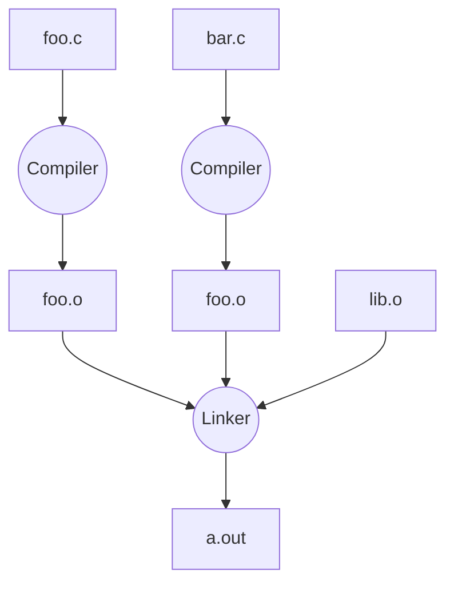

---
tags:
  - CS
  - C
  - CS61C
---
Intro to C
===
## Compiled Languages
- C compilers (`gcc`, `llvm`, etc.) map C code to **architecture-specific machine code** before the code can be run
	- Compare:
		- Java converts into architecture independent bytecode, which is compiled as the code runs (JIT)
		- Python converts into bytecode at runtime
- C compilation procedure
	- Compiling .c files to .o files (machine code object files)
	- Linking .o files into excutables (machine code)
	- Assembling in the procedure



### Advantages
- Fast (optimized for structures)
- Compilation can be optimized for speed
	- `make` (`make -j` to parallel)
	- Cached unchanged files
	- Parallelize compilation
- Python libraries are written in C


## C Pre-Processor
C source files first pass through macro processor (CPP) before compiler sees code.

- CPP replaces comments with a single space
- CPP commands
	- `#include "file.h" /* Inserts file.h into output */`
	- `#include <stdio.h> /* Looks for file in standard location (no difference) */`
	- `#define PI (3.14159) (Define constant)`
	- `#if/#endif (Conditionally include text)`
		- This can be used to include lib for different system enviroment

> [!note] To see result of preprocessing
> ```shell
> $ gcc --save-temps file.c
> ```

### Macros
CPP macros can be defined to create small "functions".
- Fact: All `#define` does *string replacement*
- `#define min(X,Y) ((X) < (Y) ? (X) : (Y))`

Macro defined functions can cause problems if it calls another function (and it has a side-effect).
- In the above example, `X` if is a function is called twice


## C Language Feature
Hello, World!
```c
#include <stdio.h>
int main(void) {
  printf("Hello, World!");
  return 0;
}
```
- `main(void)` main function has argument
- `return 0` main function return value
	- `0` means success
	- other value means failure

| Language           | C                                                | Java                                                                 |
| ------------------ | ------------------------------------------------ | -------------------------------------------------------------------- |
| Type of Language   | Function Oriented                                | Object Oriented                                                      |
| Programming Unit   | Function                                         | Class (Abstract Data Type)                                           |
| Compilation        | `gcc hello.c`<br>Creates machine language code   | `javac Hello.java`<br>Creates Java virtual machine language bytecode |
| Execution          | `./a.out`<br>Loads and executes program          | `java Hello`<br>Interprets bytecodes                                 |
| Storage            | Manual (`malloc`, `free`)                        | Automatic                                                            |
| Libraries          | `#include <stdio.h>`                             | `import java.io.File`                                                |
| Comments           | `/* block comment */`<br>`// line comment` (C99) | Same as C                                                            |
| Variables          | At beginning of a block                          | Before use                                                           |
| Operators          | ...                                              | ...                                                                  |
| Constants          | `#define`<br>`const`                             | `final`                                                              |
| Naming Conventions | `snake_case`                                     | `camelCase`                                                          |

### C99 Update
`gcc -std=c99`
`printf("%ld\n", __STDC_VERSION__);` get `199901`

- Declarations in `for` loops
- Java-like `//` comments (to end of line)
- Variable-length non-global arrays!
- `<inttypes.h>`: explicit integer types
- `<stdbool.h>`: for boolean logic def's

### C11 (C18) Update
- Multi-thread support
- Unicode strings and constants
- Removal of `gets()`
- Type-generic Macros (dispatch based on type)
- Support for complex values
- Static assertions, Execlusive create-and-open, ...

## C Syntax
### main
To get the `main` function to accept arguments:
```c
int main(int argc, char *argv[])
```
- `argc` contains the number of strings on the command line
	- Executable itself counts as one
- `argv` is a pointer to an array containing the arguments as strings
	- `argv[0]` to get the own name of program
		- To system call itself, ...
		- To print executable's name (usage string)

```c
#include <stdio.h>
int main(int argc, char *argv[]) {
  for (int i = 0; i < argc; i++) {
    printf("%s\n", argv[i]);
  }
  return 0;
}
```
```shell
$ gcc arguments.c
$ ./a.out 1 hi!
./a.out 
1 
hi!
```
- `argc = 3`
- `argv = {"./a.out", "1", "hi!"}`

### Control Flow
Same as Java, C++. (Java, C++ learned from C)

- `goto` Don't use it.
- `for` loops
	- ANSI C does not allow `for (int i = 0; ...`
	- C99 corrects and allows it

## Variables and Types
C is a strongly-typed programming language.
- Variables cannot have their types changed after declaration.
- Types help the compiler and your computer determine how to read values
- Also gives more information about the data
	- Memory size
	- Operation

> [!important]
> - All variable declarations must appear before they are used
> - All must be at the begining of a block
> - A variable may be initialized in its definition
> 	- If not, it holds garbage

### Undefined Behaviours
UBs are often characterized as "Heisenbugs"
- Bugs that seem random/hard to reproduce, and seem to disappear or change when debugging
- Cf. "Bohrbugs" are repeatable

Example:
- Variables don't have default values


### Boolean
- False values
	- `0` (integer)
	- `NULL` (pointer)
	- Boolean type `stdbool.h`
- True values
	- Everything else

### Integer
The number of bytes in an int depends on the computer.
- `int` should b integer type that target processor works with most efficiently
- Standard `sizeof(short) <= sizeof(int) <= sizeof(long) <= sizeof(long long)`
- `sizeof(short) >= 16`, `sizeof(long) >= 32`

Use `intN_t` and `uintN_t` instead (`stdint.h`).


### Consts and Enums
Constant is assigned a typed value onece in the declaration. Value can't change during entire execution of program.
```c
const float golden_ratio = 1.618;
const int days_in_week = 7;
```

Enumerate is a group of related integer constants.
```c
enum color {RED, GREEN, BLUE};
```
- `enum TYPE {VALUES}`
- To use, declare a variable as `TYPE`, and assign it value in `VALUES`


### Typed Functions
- Return type
	- Can be any C variable type (integers, pointers, references, ...)
	- Can be `void` (no return value)
- Parameter type

Variables and functions must be declared before used.

### Struct
https://stackoverflow.com/questions/1675351/typedef-struct-vs-struct-definitions
Typedef allows you to define new types.
```c
typedef uint8_t BYTE;
BYTE b1, b2;
```

Structs are structured groups of variables.
```c
typedef struct {
  int length_in_seconds;
  int year_recorded;
} SONG;
SONG song1;
song1.length_in_seconds = 114;
song1.year_recorded = 2007;
```

## Bitwise Operations
Bitwise operations perform logical operations for every bit in a number.
- `&` bitwise AND
- `|` bitwise OR
- `^` bitwise XOR
- `~` bitwise NOT

> [!example]-
> $$\begin{array}{cccccccc}
> & 0\mathrm b & 0 & 1 & 1 & 0 & = & 6\\
> \& & 0\mathrm b & 0 & 1 & 0 & 1 & = & 5\\
> \hline
> & 0\mathrm b & 0 & 1 & 0 & 0 & = & 4\\
> \end{array}$$

Bitwise shifting move all bits of LHS to left/right by RHS bits.
- `a << n` left shift
- `a >> n` right shift

> [!example]+
> ```
> 0b 0110 >> 2
> = 0b __01
> = 0b 0001
> ```

## Pointers
A pointer stores a memory address and references a variable of its type.

- Usage of `*`
	- `int *p` **declares** that `p` is a pointer
	- `*p` **dereference** the pointer
		- `*p` gets the value that `p` points to
		- `*p =` changes the value that `p` points to
- Usage of `&`
	- `&x` get the address of variable `x`

Declaring a pointer does not allocate space for something to be pointed to.
```c
int *x;
int y;
x = &y; // Totally legit
*x = 1; // Crashes!
```
### Passing values
> [!important] Difference between C and C++
> C does not have reference types
> C do not have pass by reference.

==C always passes parameters by value.==

To achieve the effect of passing by reference, use pointers.
```c
void addOne(int *x) {
  *x += 1;
}
```

### Data Types of Pointers
- Pointers can be any data type
- Pointer can only point to the variable of the same type
- Generic pointer `void *`

### Function Pointers
```c
int (*fn) (void *, void *) = &foo;
```
- `fn` is a function that accepts two `void *` pointers and returns an `int`
- Initialized to point to `foo`

```c
(*fn)(x, y); // call the function
```

### NULL Pointer
`char *p = NULL`
`p: 0x00000000`

Tests for NULL pointer:
```c
if (!p) {/* p is a null pointer*/ }
if (q) {/* q is not a null pointer*/ }
```

- Read/write from a null pointer crashes the program

### Pointer to Structs
```c
typedef struct {
  int x;
  int y;
} Coord;

Coord coord, *ptr = &coord;
int k;
k = ptr->x;
k = (*ptr).x; // equivlalent
```
 
## Arrays
An array is a block of memory.
```c
int arr[2]; // Declares (random value)
int arr_filled[] = {1, 2}; // Declares and initialize
int x = arr_filled[0]; // Array access
x = *(arr_filled + 1) // Pointer arithmetic
```

The array's signature is a pointer constant, whose value and address is the same.
```c
int *p = arr;
```

- Array bounds are not checked during element access
	- Segmentation fault: Address being accessed is invalid
	- Bus error: Accessing wrong bit length
- An array is ==passed to a function as a pointer==
```c
void sort(int32_t arr[], uint_32 size);
```
- Declared arrays are only allocated while the scope is valid
```c
char *foo() {
  char str[32]; ...
  return str; // str is gone
}
```
### Specifying the ARRAY_SIZE
==Single source of truth==
```c
const int ARRAY_SIZE = 10;
int i, a[ARRAY_SIZE];
for (i = 0; i < ARRAY_SIZE; i++) { ... }
```

### Pointer Arithmetic
- `ptr + n`
	- Add `n * sizeof(*ptr)` to memory address
- `ptr - n`
	- Subtracts `n * sizeof(*ptr)` to memory address
- `a[i]` equivalents `*(a + i)`

### Function to Change Pointers
In order to mutate a pointer in functions, we need a **pointer to a pointer**.
- Declared as `data_type **h`
```c
void increment_ptr(int32_t **h) {
  *h = *h + 1;
}
```

## C Strings
A C string is an array of characters, followed by a null terminator.
- Null terminator: the byte 0 (number), the `\0` character
- `char str[] = "abc"` equiv `char str[] = {'a', 'b', 'c', '\0'}`

The standard C library `string.h` assumes null-terminated strings.

## Memory, Address and Word Alignment
- Modern machines are "byte-addressable"
- Word size: number of bits in an address
	- A 64b architecture has 8-byte words
	- `sizeof(int *) == sizeof(char *) == 8`
 - A C pointer is an abstracted memory address
	 - Pointer type declaration tells the compiler how many bytes to fetch on each dereference
- ==Word alignment: only allowing addressing in 8-byte boundaries==
	- This is also how the memory in `struct` works (padding)

>[!info] **Alignment Restriction**
> A requirement that data be aligned in memory on natural boundaries.
> With this restriction, memory access that are not aligned are not allowed.
> - x86, RISC-V: No restriction
> - MIPS: Does
```RAM
+-------------------------------------------------------+
|                        int32_t *                      | 0xFFFFFFFFFFFFFFF8
+-------------------------------------------------------+
|                         short *                       | 0xFFFFFFFFFFFFFFF0
+-------------------------------------------------------+
|                         char *                        | 0xFFFFFFFFFFFFFFE8
+-------------------------------------------------------+
|            64bit integer stored in 4-bytes            | 0xFFFFFFFFFFFFFFE0
+-------------------------------------------------------+
| 16bit short |      |      |      |      |      |      | 0xFFFFFFFFFFFFFFD8
+-------------------------------------------------------+
| char |      |      |      |      |      |      |      | 0xFFFFFFFFFFFFFFD0
+------+------+------+------+------+------+------+------+
|      |      |      |      |      |      |      |      | ...
+------+------+------+------+------+------+------+------+
```

### Endianess
Reference: https://en.wikipedia.org/wiki/Endianness
- Little endian
	- The least significant byte of a value is stored first
- Big endian
	- The most significant byte of a value is stored first

```RAM
int32_t 0x12345678:
+------+------+------+------+------+------+------+------+
| 0x78 | 0x56 | 0x34 | 0x12 |      |      |      |      |
+------+------+------+------+------+------+------+------+
```