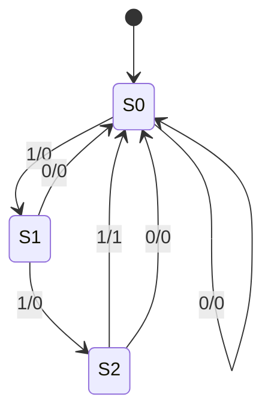

---
tags:
- CS
- ComputerStructure
---
State
===
## State Elements
Uses:
- As a place to store values for some indeterminate amount of time:
	- Register files
	- Memory (cache, main memory)
- Help control the flow of information between combinational logical blocks

### Example: Accumulator
```c
int sum = 0;
for (int i = 0; i < N; i++) {
   sum += x[i];
}
```
- Each time of addition, the last sum must be **feedbacked** into the adder

```
x_i ---/---> |\
             |+|---/---+----> S
        ---> |/        V
        |           +--|--+
        |     reset-| reg <-Load/CLK
        |           +--|--+
        |              V
        ----------------

CLK ____|‾‾‾‾|____|‾‾‾‾|____|‾‾‾‾|____|‾‾‾‾
        ┆     ____┆____ ____┆____ ____┆____
S       ┆    |x0       |x0+x1    |x0+x1+x2 |
        ┆     ‾‾‾‾┆‾‾‾‾ ‾‾‾‾┆‾‾‾‾ ‾‾‾‾┆‾‾‾‾
        ┆_________┆_________┆_________┆
X       |   x0    |   x1    |   x2    |
         ‾‾‾‾‾‾‾‾‾ ‾‾‾‾‾‾‾‾‾ ‾‾‾‾‾‾‾‾‾
```

## Register and Flip Flops
An N-bit register is N instances of a "Flip-Flop"
```
     |             d_n-1   d_n-2          d_0
     / n             |       |             |
     V               V       V             V
+----D----+         +--+    +--+          +--+
|Register < CLK  =  |FF<--  |FF<--   ...  |FF<-+--CLK
+----Q----+         +--+ |  +--+ |        +--+ |
     |               |   ----|---+-- ... --|----
     / n             V       V             V
     V             q_n-1   q_n-2          q_0
```

![[3.2 Flip Flops#Remembering States]]
![[3.2 Flip Flops#The Clocked Data Flip Flop (DFF)]]
## Timing of a Flip-flop
- Edge-triggered d-type filp-flop
	- Mostly "**rising edge-triggered**" `__↑‾‾`
	- AKA "positive edge"
- ==On the rising edge of the clock, the input `d` is sampled and transferred to the output==
- At all other time, the input `d` is ignored

Example:
```
CLK _____|‾‾‾‾‾|_____|‾‾‾‾‾|_____|‾‾‾‾‾|_____|‾‾‾‾‾
         ┆           ┆           ┆           ┆
d   _____┆_____|‾‾‾‾‾┆‾‾‾‾‾|_____┆_|‾‾‾‾‾|___┆___|‾
         ┆ ↖         ┆ ↖         ┆ ↖         ┆ ↖
q   ███████__________┆_|‾‾‾‾‾‾‾‾‾┆‾|_________┆_____
           ^(delay)
```

### Flip-flop Delay
Delay of a Flip-flop:
```
        >┆   ┇ ┆<--Input data must be
         ┆   ┇ ┆   stable in this period
         ┆   |‾┆‾‾‾‾‾‾┆‾‾‾‾
CLK     >┆   |<---"setup" time
    _____┆___| ┆      ┆
         ┆  >┇ ┆<--"hold" time
       |‾┆‾‾‾┇‾┆‾‾‾‾| ┆
d      | ┆   ┇ ┆    | ┆
    ___| ┆   ┇ ┆    |_┆_____
         ┆   ┇ ┆      ┆
         ┆   ┇ ┆      |‾‾‾‾‾
q        ┆  >┇ ┆      |<--"clk-to-q" delay
    _____┆___┇_┆______|
         ┆   ┇ ┆      ┆
```

### Proper Timing
- In practice, two inputs might not arrive at the same time
- So output may be temporarily wrong, but register always captures correct value
- In good circuits, instability never happens around rising edge of CLK
	- Overclocking might break this (CLK cycle smaller than "setup" + "hold")

```
--------  X_i
|      |   |
|     _V___V_
|     \__+__/
|        |
|        +-----> S_i
|        V
|    +---|---+
|RST-|  reg  <--CLK
|    +---|---+
|        V S_i-1
----------              >|  |<-- ADD propagation delay
                        >| |<--- Delay of X_i
                        >||<---- CLK-to-Q
RST  __|‾‾‾‾‾┆‾‾‾‾‾|_____┆_____      ┆           ┆
             ┆           ┆           ┆           ┆
CLK  ‾‾|_____|‾‾‾‾‾|_____|‾‾‾‾‾|_____|‾‾‾‾‾|_____|‾‾‾‾‾|_____
        reset┆↘__________┆ __________┆ __________┆ _____
S_i-1 ████████|     0     |    x0     |   x0+x1   | x0+x1+x2
             ┆ ‾‾‾‾‾‾‾‾‾‾┆ ‾‾‾‾‾‾‾‾‾‾┆ ‾‾‾‾‾‾‾‾‾‾┆ ‾‾‾‾‾
             ┆   ________┆__ ________┆__ ________┆__ ___
X_i         0┆  |    x0     |    x1     |    x2     |
           ‾‾┆‾‾ ‾‾‾‾‾‾‾‾┆‾‾↘‾‾‾‾‾‾‾‾┆‾‾↘‾‾‾‾‾‾‾‾┆‾‾ ‾‾‾
             ┆        ___┆_____↘_____┆_____↘_____┆_____
S_i         █████████|    x0   █|   x0+x1  █| x0+x1+x2 █|
                      ‾‾‾┆‾‾‾‾‾↑‾‾‾‾‾┆‾‾‾‾‾ ‾‾‾‾‾┆‾‾‾‾‾ 
                               |
                          temp wrong
						  X_i is asynchronized
                          (x0 from S_i-1 + x0)
```

## Pipelining
The maximum clock frequency of a state machine circuit
- Combinational Logic
- Register
```
Inputs   +-------------+   Outputs
-------->|Combinational|--------->
-------->|    Logic    |------
|        +------1------+     |
|                 next state |
|                  -----------
|                  |
|             +---2|----+
|         CLK-> Register|
|             +---3|----+
|                  V
|                  |
--------------------
```
1. CL Delay
2. Setup Time
3. CLK-to-Q Delay

$$\text{Max Delay = CLK-to-Q Delay + CL Delay + Setup Time}$$

Extra Registers are often added to help speed up the clock rate
- ==Split long CL Delay by inserting Registers in between==
- Con: More time to finish one thing (Delay of 1 more clock cycle)
- Pro: More outputs per second (higher clock frequency)


## Finite State Machines
- An FSM consists of:
	- A set of states
	- A transition function: f = (current state, input) => next state, output
- To run an FSM, repeat these steps:
	- Receive an input
	- Based on current state and input, move to the next state and generate an output
### State Transition Diagram
- S0, S1, S2 are the states
- An arror point to initial state (or double circle the initial state)
- Each arrow represents a transition
	- Arrow from current state to next state
	- Left label on arrow is the input
	- Right label on arrow is the output
- Example of arrow transition:
	- Arrow from S0 to S1, labeled 1/0
	- If you’re at state S0 and receive input 1, then move to state S1, and output 0
- Example of arrow transition:
	- Arrow from S2 to S0, labeled 1/1
	- If you’re at state S2 and receive input 1, then move to state S0, and output 1



### Hardware Implementation of FSM
- A register is needed to hold the representation of which state the machine is in
	- Use a unique bit pattern for each state
- Combined logic circuit is used to implement a function mapping the input and present state (PS) input to the next state (NS) and output

```
Input    +-------------+   Output 
-------->|Combinational|--------->
-------->|    Logic    |------
|        +-------------+     |
|                            |
|                  -----------
|               NS /
|             +----V----+
|         CLK-> Register|
|             +----V----+
|               PS /
|                  |
--------------------
```

- Combinational logic functional specification: Truth Table

| PS  | Input | NS  | Output |
| --- | ----- | --- | ------ |
| 00  | 0     | 00  | 0      |
| 00  | 1     | 01  | 0      |
| 01  | 0     | 00  | 0      |
| 01  | 1     | 10  | 0      |
| 10  | 0     | 00  | 0      |
| 10  | 1     | 00  | 1      |

## General Model for Synchronous Systems
- Collection of CL blocks separated by registers
- Registers may be back-to-back and CL blocks may be back-to-back
- Feedback is optional
- Clock signal(s) connects only to clock input of registers