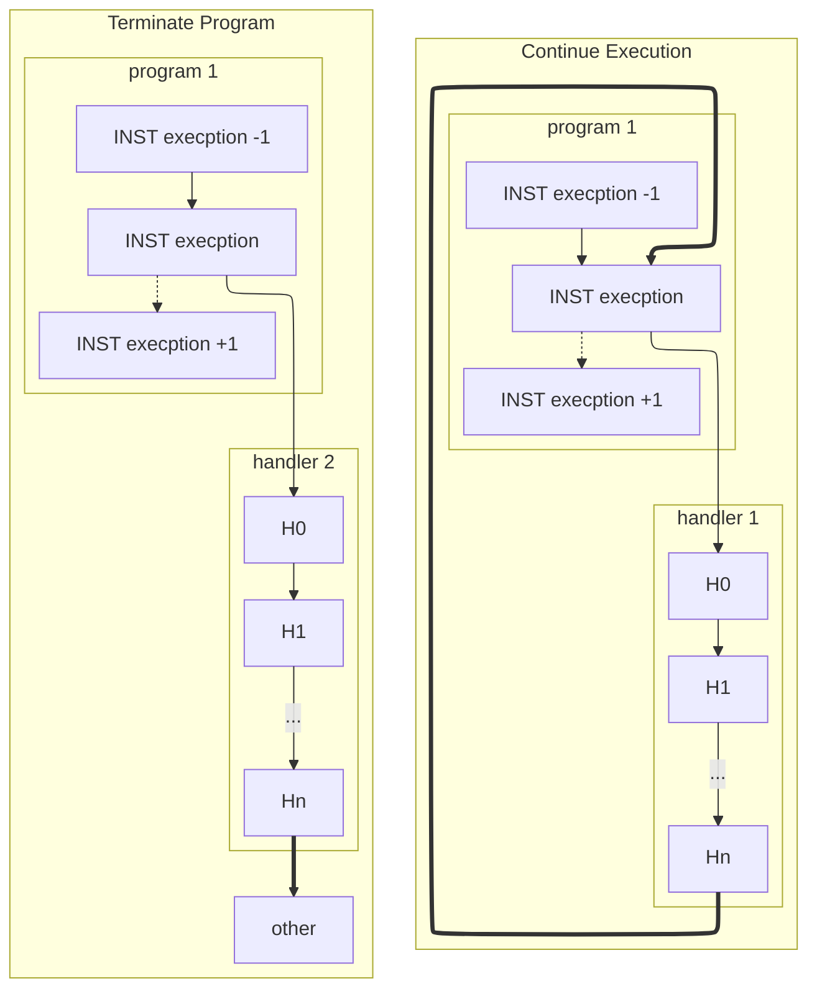
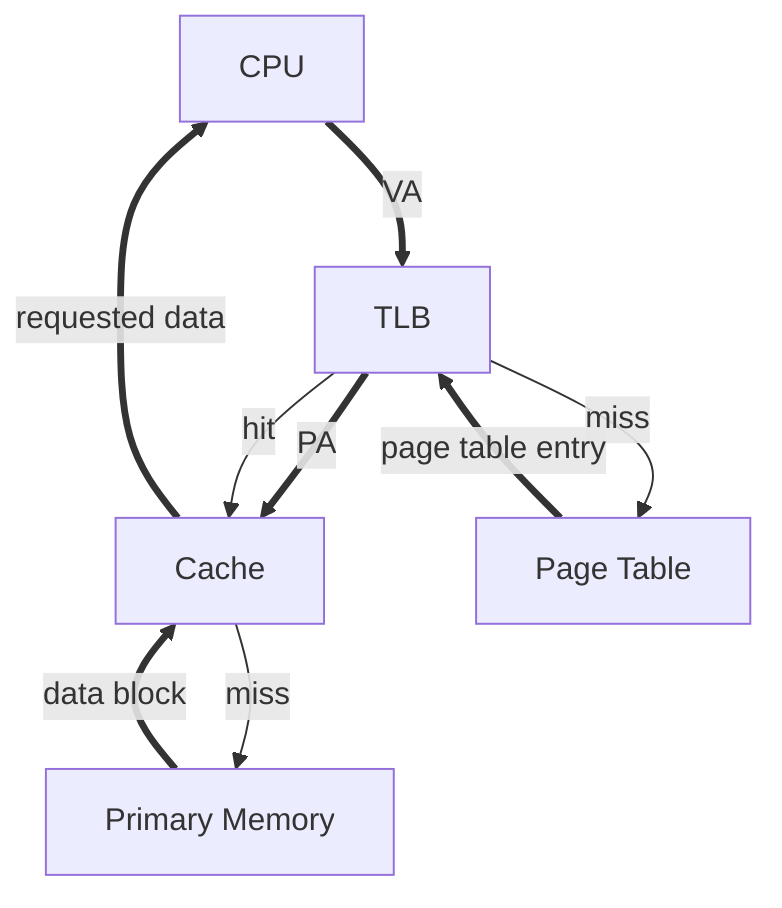
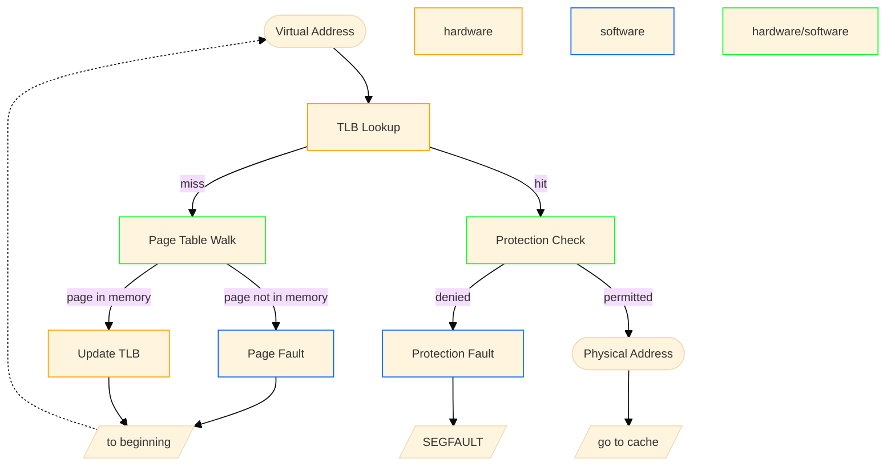

---
tags:
- CS
- ComputerStructure
---
Virtual Memory and OS
===
Things covered so far:
- CPU
- Caches

Things not covered so far:
- Memory
- I/O

## Intro to OS
- OS is the (first) thing that runs when computer starts
	- Start services
		- fs, network, tty...
- Provides interaction with the outside world
	- Finds and controls all devices in the machine in a general way: Relies on hardware specific “device drivers”
- Loads, runs and manages programs:
	- **Isolation**: Each program runs (i.e., appears to run) separately, and thinks it has the control of all the resources.
	- Resource-sharing: Multiple programs share the same resources:
		- Memory
		- I/O devices: disk, keyboard, display, network, ...
	- Time-sharing: Processor (CPU) runs multiple processes.

**Multiprogramming**: running multiple applications (**processes**) "simultaneously" on **one CPU**
- The OS manages mulitprogramming
- Achived via **OS context switches**, switches between processes very quickly:
	- Save current process state (program counter, registers, etc.)
	- Load next process state to execute next instruction on CPU
	- Do not switch out data between main memory and disk (costly)


## Physical Memory and Disk Storage
Main memory: DRAM
- Dynamic Random Access Memory
	- Latency to access first word: \~10ns, \~30-40 clock cycles
	  Each successive (0.5ns - 1ns)
	- Each access brings 64 bits, 'burst access' (multiple access at one time)
	- Expensive
- Data is impermanent
	- Dynamic: capacitors store bits, so needs periodic refresh to maintain charge
	- Volatile: when power is removed, loses data.
- Contrast with SRAM
	- Static (no capacitors) but still volatile
	- Faster (0.5 ns)/more expensive/lower density


Second memory: Disk, SSD
- Attached as a peripheral I/O device (non-volatile)
- Solid-State Drive (SSD)
	- Access: 40-100 μs (~100k cycles)
	- Cheap
- Hard Disk Drive (HDD)
	- Access: < 5 - 10 ms (10-20M cycles)
	- Cheaper

## Virtual Memory and Virtual Addresses
> [!question] Troubles with Memory 
> 1. What if main memory is smaller than the program address space?
> 	- 32-bit systems: 4 GiB addressable memory
> 	- But only 1 GiB RAM
> 2. What if two programs access the same address address?
> 	- Overwriting each other: **Data corruption**
> 	- Need protection

Virtual memory is the next level in the memory hierarchy
- Give each process the *illusion* of a full memory address space that it has completely for itself.
 - Under the hood: working set of **pages** reside in main memory; other pages are in disk.


Benefits:
- **Demand paging** provides the ability to run programs larger than the primary memory (DRAM)
- OS can share memory and **protect** programs from each other.
- Hides difference between machine configurations

**Address Space**: set of addresses for all available memory locations
- **Virtual Address Space**
	- Set of addresses that the user program knows about
- **Physical Address Space**
	- Set of addresses that ==map to== actual physical locations in memory
	- Hidden from user applications
- For each program, a memory manager **maps (translates)** between Virtual and Physical address spaces
	- Processes use virtual addresses
		- Many processes, using same (conflicting) addresses
	- Memory uses physical address

### OS Virtual Memory Management Responsibilities
1. Map virtual addresses to physical addresses
2. Use both memory and disk
	- Give illusion of larger memory by storing some content on disk.
	- Disk is usually much larger and slower than DRAM.
3. Protection
	- Isolate memory between processes.
## Paged Memory
Concept of "Paged Memory":
- Physical memory (DRAM) is broken into pages.
- A disk access loads an entire page into memory. (swap)
- Typical page size: 4 KiB+ (on modern OSs)
	- Need 12 bits of page offset to address all 4 KiB bytes.

If virtual and physical pages are the same size, then memory translation only need to map **Virtual Page Number (VPN)** to a **Physical Page Number (PPN)**

```
Virtual address
       |VPN (20 bits)|offset (12 bits)|
Physical address  |
   |PPN (36 bits) V  |offset (12 bits)|
```

### Translation: Accessing Memory
1. Program executes a load specifying a virtual address (VA)
2. Computer translates VA to the physical address (PA) in memory.
	- Extract virtual page number (VPN) from VA
		- e.g., top 20 bits of page size 4KiB = 2\^12 B
	- Look up physical page number (PPN) in **page table**
	- Construct PA: ==physical page number + offset (from virtual address)== (concat)
3. If the physical page is not in memory, then OS loads it in from disk.
	- Load the page into memory
	- Update the page table to map the loaded PPN to the VPN
4. The OS reads memory at the PA and returns the data to the program.

```
     Program              Page Table          DRAM
32-b virtual           |  VPN  |  PPN  |   physical address space
address space          |  ...  |  ...  |  |      ...      |
                       |0x60000| disk  |  |    data for t0|
lb t0, 0xFFFFF001(x0)  |  ...  |  ...  |  |               |
                       |0xFFFFF|   1   |  |               |

     Program              Page Table          DRAM
32-b virtual           |  VPN  |  PPN  |   physical address space
address space          |  ...  |  ...  |  |      ...      |
                       |0x60000|   2   |  |    data for t0|
lb t0, 0xFFFFF001(x0)  |  ...  |  ...  |  |    data for t1|<---disk read
lb t1, 0x60000030(x0)  |0xFFFFF|   1   |  |               |
                                   ^update page table
```


### Page Table
==Page table look up: **Index - Physical page number KV pairs**==
One page table per process:
- One entry per virtual page number
- Number of entries: (virtual address number) / (page size)
- Each entry:
	- Status bits
	- Physical page number / disk address mapped to
- A page table is a lookup table (contains no data)
- All VPNs have a valid entry
	- like cache index
	- no tags

#### Protection with Page Tables
- Each process has a ==dedicated page table==
	- OS keep track of which process is active
- **Isolation**: Assign processes different pages in DRAM
	- Prevents accessing other processors' memory
	- Page tables managed by OS
- Sharing is also possible:
	- OS may assign some physical pages to several processes
	- e.g., Read-only system data
- Page Table Entry includes a **write protection bit** (read-only)
	- If on, then the page is **protected**
		- e.g., text segment, system data
		- Writing to a protected page triggers an exception (handled by OS)

#### Page Table Functionality
Page tables are stored in memory
- Each process needs a page table, so too large for cache
- ==On memory access cache miss, two (slow memory accesses)==
	- First access page tabe in main memory to translate to PA
	- Then read physical page in main memory


Performance of Page Tables:
- Transfer blocks (not words) between DRAM and processor cache
- Use a cache for frequently used page table entries

#### Page Faults
Page table entries store status to indicate if the page is in memory or only on disk
- On each memory access, check the page table entry “**valid**” status bit.
- Valid -> In DRAM
	- R/W data in DRAM
- Invalid -> On disk
	- Triggers a **Page Fault**; OS intervenes to ==allocate the page into DRAM==.
	- If out of memory, first ==evict a page== from DRAM.
	- Store evicted page to disk.
	- Read requested page from disk into DRAM.
	- Finally, read/write data in DRAM.

> [!note] Page Replacement Policy
> The page replacement policy (e.g., LRU/FIFO/random) is usually done in OS/software; this overheard << disk access time.
> - OS perform page replacement whilest accessing the disk


#### Page Table Status Bits
- Write protection bit
	- On: If process writes to page, trigger **exception**
- Valid Bit
	- On: Page is in RAM
- Dirty Bit
	- On: Page on RAM is more up-to-date than page on disk

#### Write Policy with Page Table
Always **write-back** (disk accesses too long)

On page fault (invalid, data to read is on disk):
- Retrive data page (to load in)
- Update page table

On page eviction (memory is full, need new page into memory):
- ==Write back to disk==

### Hierarchical Page Tables
Page tables are too large if too many processes -> Page Table Hierarchy

- Multilevel page tables with decreasing page size
	- Key: Sparsity of Virtual Address Space use. Most program use only a fraction of virtual memory, ==many page tables are not accessed==
- Level 1 page table **always in DRAM**
- Level 2 page tables can be in disk; loaded into DRAM via L1 access


Example: 32-bit virtual memory address space, 4 GiB DRAM, 4 KiB pages:
- Page table entry size is 4 B for all levels of page tables.
- **RV32I 2-level mapping:**
```
virtual 31          22 21          12 11         0
address| L1 index (10)| L2 index (10)| offset (12)|
```

- **Page Table Register (SPTBR)** stores the address of the L1 page table

```
SPTBR
  Root of current L1 Page Table

DRAM
  Level 1 page table - 2^10 entries:
    - PPN for Level 2 page table
    - Status bits
  Level 2 page tables - 2^10 entries:
    - PPN for data page table
    - Status bits
  Data pages...

Disk
  L2 page tables
  Data pages
```
Compare:
- 1-level page tables takes up 4 MiB each process
- 2-level page tables takes up 4 KiB for L1, more in disk


#### Page Table Translation
Given a virtual memory address, first divide the address into three parts:
- L1 index (10 bits)
- L2 index (10 bits)
- Offset (12 bits)

Steps taken to translate:
1. Look up the **L2 Physical Page Number** in L1 Page Table at the **L1 index**
	- L1 page table stores L2 Physical Page Number in each of its index
		- You can imagine there're no offset, page tables occupies whole pages
	- If in disk, load L2 from disk, update L1
	- Now we have L2 PPN
2. Go to the L2 Page Table, look up the **Data Page Number** in L2 Page Table at the L2 index
	- If in disk, load Data page from disk, update L2
	- Now we have Data PPN
3. Finally, **concat** Data PPN + Page offset to get **Physical Address**

## OS Boot
> [!todo]
## OS Exceptions
### Supervisor Mode & User Mode
- CPUs have a hardware **supervisor mode** (**kernel mode**)
	- Set by a status bit in a special register.
	- An OS process in supervisor mode helps ==enforce constraints to other processes==, e.g., access to memory, devices, etc.
	- (`su` in hardware)
- In **user mode**, a process can only access a subset of instructions and physical memory
	- Can change **out of** supervisor mode using a special instruction (e.g. `sret`).
	- Cannot change **into** supervisor mode directly; instead, HW interrupt/exception.
	- The OS mostly runs in user mode, need to be careful with Supervisor mode

### Exceptions and Interrupts
Exceptions
- Caused by an event ==during the execution== of the current program.
- **Synchronous**; must be handled immediately.
- Examples
	- Illegal instruction
	- Divide by zero
	- ==Page fault==
	- Write protection violation

Interrupts
- Caused by an event ==external to== the current running program.
- **Asynchronous** to current program; does not need to be handled immediately (but should be soon).
- Examples:
	- Key press
	- Disk I/O

#### Exception Handling
The **Trap Handler** is software that services interrupts/exceptions.

Workflow:
1. **Complete** all instructions **before** the faulting instruction
2. **Flush** all instructions **after** the faulting instruction
	- Convert to `nop`s, bubbles
	- Flush faulting instruction
3. **Transfer execution** to trap handler (in supervisor mode)
	- **Optionally** return to the original program and **re-execute** instruction
	- Program backs to normal as nothing happened

Trap Handler workflow:
1. Save the state of the current program
	- Save all the registers, PC, Page Table Reigster
2. Determine execption/interruption type
	- Inferred by **faulting instruction** and its **current pipeline stage**, e.g.:
		- IF/ID: PC address exception
		- ID/EX: Illegal opcode
		- EX/MEM: Data address exception
3. Handle exception/interruption, then do one of the two things:
	- Continue execution of the program
		4. Restore program state
		5. Return control to the program
	- Terminate the program
		4. Free the program resources
		5. Schedule a new program


- Depending on the type of Exception (IO, trap/syscall, fault), the handler returns control to either I+0 or I+1, more on [[CSAPP/Exceptional Control Flow/Exceptions]]
##### Handling Context Switches
Context Switches
- OS switches between processes by changing the internal state of the processor.
- Allows a single processor to “simultaneously” run many programs.

Procedures of context switches:
- The OS sets a timer. When it expires, perform a **hardware interrupt**.
- Trap handler **saves all register values**, including:
	- Program counter (PC)
	- Page Table Register (SPTBR in RV32I)
		- The memory address of the active process's page table
- Trap handler then loads in the **next** process’s registers and returns to user mode.

All other processes are in DRAM, until the trap handler load their registers into CPU and return to user mode.

##### Handling Page Faults
Page faults: An accessed page table entry has valid bit off -> data is not in DRAM.

Page faults are handled by the trap handler
- The **page fault exception handler** initiates transfers to/from disk and performs any page table updates.
- If pages needs to be swapped from disk, perform **context switch** so that another process can use the CPU in the meantime.
	- A "precise trap" so that resuming a process is easy.
- Following the page fault, **re-execute the instruction**.


### System Calls
A system call (**syscall**) is a "**software interrupt**" that ==envokes the trap handler==, allowing a program to request a service from the OS
- In the form of function call, executed by kernel
- Examples
	- File I/O, file system operations
	- Accessing external devices
	- `printf`, `malloc`, (`ecalls` in RISC-V)
	- Launch a new process

Launch a new process from a process:
- Shell **forks**: a syscall that traps into the OS kernel process
- OS (supervisor mode): Load program (see CALL); jump to start of main. Return to user mode.
- Shell: “wait” for main to return (**join**)


## Caches and Virutal Memory
Blocks, pages, (bytes, words) are all units of memory
- Cahces: **blocks**
	- ~64 B
- Memory:**pages**
	- ~4 KiB

Functionality
- Cache
	- Data at each level is a **quick-access copy** of data at a lower level in the memory hierarch
- Page Table
	- Translates address, store **physical page numbers**
	- Facilitate **Demanding Paging**
		- Cache data pages in memory.
		- Access disk pages only on demand by the process.
		- Page Table keeps track of page status/location.


|                    | Caching                                                     | Demand Paging                                            |
| ------------------ | ----------------------------------------------------------- | -------------------------------------------------------- |
| Memory Unit        | Block                                                       | Page                                                     |
| - Size             | 32B to 64B                                                  | 4KiB to 8KiB                                             |
| - Misss            | Cache Miss                                                  | Page Fault                                               |
| Associativity      | Direct-mapped<br>N-way Set associative<br>Fully associative | Fully associative<br>(disk pages can be placed anywhere) |
| Replacement policy | LRU or random                                               | LRU, FIFO, random                                        |
| Write policy       | Write-through / write-back                                  | Write-back                                               |

## Translation Lookaside Buffer (TLB)
==**Virtual Memory = address translation + protection + demand paging**==
Effect of Virtual Memory: the illusion of a large, **private**, and **uniform** storage
- Privacy means **Protection**:
	- Several users/processes, each with their own private address space.
- Uniform storage means **Demand Paging**
	- The ability to run programs larger than primary memory (DRAM).
	- Hides difference in machine configurations.

Price: Address translation on each memory reference, increase AMAT
- Virtual Memory should be **fast** (~1 clock cycle) and **space efficient**
	- ==Every instruction/data access needs address translation.==
- But page tables are in memory, every instruction/data access needs a **page table walk**
	- Single level page table: 2 memory accesses
	- Two level page table: 3 memory accesses
- Solution: ==**Cache** some translations== in the **Translation Lookaside Buffer (TLB)**

The **Translation Lookaside Buffer (TLB)** ==caches page table entries==:
- TLB hit: Single-cycle translation
- TLB miss: Page table walk to refill TLB

```
VA |    VPN    | offset |
         |            |
TLB------V---------   |
|V|D|TLB tag| PPN |   |
-------------------   |
| | |       |     |   |
| | |       |     |   |
-------------------   |
    miss|      |hit   ----------------------
        |      |                           V
        V      ------------> |   PPN   | offset | Physical Address
  Page Table Walk
```
- Valid/Dirty bit

> [!example] TLB Entry bit width calculation
> - 16 KiB pages
> - 40-bit VA
> - 64 GiB physical memory
> - 2-way set associative TLB with 512 entries
> 
> 16 KiB pages -> 14 bit Page offset -> VPN = 26 bits
> 64 GiB memory -> 36 bit PA -> PPN = 22 bits
> 2-way 512 entry TLB -> TIO: 18/8/14 -> TLB Tag = 18 bits
> 
> Layout: 45 bits
> - Valid: 1 bit
> - Dirty: 1 bit
> - Ref: 1 bit
> 	- Reference bit: [Reference](https://sites.cs.ucsb.edu/~chris/teaching/cs170/doc/cs170-08.pdf)
> - Access rights: 2 bits
> - TLB TAg: 18 bits
> - PPN: 22 bits
### TLB Tag, Index, Offset
The TLB is indexed by the Virtual Page Number

Virtual Address split up:
```
VA | TLB tag | TLB index | offset | < Page offset
   |<--------VPN-------->|
```
- TLB index/tag is used just like in a cache
	- Index for the entry index (position) in TLB
	- Tag for matching entries
- TIO for VA and PA are unrelated
	- VA: TLB tag, TLB index, Page offset
	- PA: Cache tag, Cache index, (Cache) Block offset

### Memory Access with TLB
- We assume **Physically Indexed, Physically Tagged** caches
- TLB first, then cache (VA -> PA)



### TLBs in the Datapath
```
+-----+         +-------+      +------+      | \              +-------+
| PC  |->Inst.->| IMEM  |->IF->|Decode|->ID->|  \   EX->Data->| DMEM  |->MEM
|     |   TLB   | Inst. |  /   +------+  /   >EX|-> /   TLB   | Data  |   /
+--^--+    |    | Cache |  ID            EX->|  /   MEM  |    | Cache |  WB
           V    +-------+  ^             ^   | /         V    +-------+   ^
```
- Each instruction/data access = address translation + functional checks
- Handle:
	- **TLB Miss**: Needs a mechanism to refill TLB (usually done in hardware).
	- **Page Fault**
		- Needs a **precise trap** so that software handler can easily re-execute instruction after page retrieval.
	- **Protection Violation** check
		- A violation may abort the process, e.g., **SEGFAULT**.

Handling Context Switches with TLB
- Keep all page tables for all currently running processes in DRAM.
- Instead, ensure that all TLB entries refer to the **active process**.
- Extra steps:
	- Trap handler also sets all TLB entries to **invalid** after saving all register values

![[page_based_virtual_memory_machine.jpg]]



## Virtual Memory Performance
Hierarchy:
- Cache policies manages memory between Cache and DRAM
- Virtual Memory manages memory between DRAM and Disk
	- TLB comes befores the cache but affects transfer of data between DRAM/Disk

Average Memory Access Time with VM:
- Now disk is lowest level
- Main memory is a mid-level cache
	- Hit rate = 1 - Page Fault Rate

> [!example]+ AMAT
> - L1 Cache
> 	- Hit Time: 1 cycle
> 	- Hit Rate: 95 %
> - L2 Cache
> 	- Hit Time: 10 cycles
> 	- Hit Rate: 60%
> - DRAM
> 	- Hit Time: 200 cycles
> 	- Hit Rate: H R_mem
> - Disk
> 	- Hit Time: 20,000,000 cycles
> 
> AMAT with DRAM only:
> ```
> AMAT = 1 + 5% * (L1 miss penalty)
>      = 1 + 5% * (10 + 40% * L2 miss penalty(200 cycles))
>      = 5.5 cycles
> ```
> AMAT with demanding paging:
> ```
> AMAT = 1 + 5% * (10 + 40% * (200 + (1 - HR_mem) * 20,000,000))
>      = 5.5 + (5% * 40% * (1 - HR_mem) * 20,000,000)
> ```
> - Page Fault Rate should \<\< 0.01%

## I/O Devices
Input/Output devices are used for human to interact with the computer.

Processor and I/O Device interaction:
- Input: Read a sequence of bytes
- Output: Write a sequence of bytes

Interface options:
- Special input/output instructions & hardware
- **Memory mapped I/O**
	- Portion of **address space** **dedicated to I/O**
	- I/O device have registers (no memory)
	- Use normal load/store instructions, e.g. lw/sw
	- Very common, used by RISC-V

**Memory Mapped I/O**
For Memory Mapped I/O Devices, certain memory addresses are dedicated for I/O devices and **correspond to registers in I/O devices**
- e.g., address `0x00000000-7FFFFFFFF` are for Memory-mapped I/O, `0x80000000-FFFFFFFF` are for Program and Data

Problem: Process-I/O Speed are usually mismatched, I/O device data rates are varying themselves.

> [!info]- Comparing Processor and I/O Speed
> 1 GHz processor I/O throughput:
> - 4 GiB/s (lw/sw)
> 
> I/O data rates:
> - 10 B/s (keyboard)
> - 3 MiB/s (Bluetooth 3.0)
> - 0.06-1.25 GiB/s (USB 2/3.1)
> - 7-250 MiB/s (Wifi, depends on standard)
> - 125 MiB/s (G-bit Ethernet)
> - 480MiB/s (SATA3 HDD)
> - 560 MiB/s (cutting edge SSD)
> - 5GiB/s (Thunderbolt 3)
> - 32 GiB/s (High-end DDR4 DRAM)
> - 64 GiB/s (HBM2 DRAM)

### I/O Polling
**Polling** - Processor checks status, then act:
- Device registers generally serve two functions
	- **Control Register**: I/O ready indicator
	- **Data Register**: contains data
- Processor reads from Control Register in loop
	- Waiting for device to set Ready bit in Control reg (0 -> 1)
		- `volatile` keyword for C
	- Indicates “data available” or “ready to accept data”
- Process then loads from (input) or writes to (output) data register
	- I/O device resets control register bit (1 -> 0)

Example:
```
# Input: read into a0
  lui  t0, 0x7ffff  # io addr
Waitloop:
  lw   t1, 0(t0)    # read control
  andi t0, t0, 0x1  # ready bit
  beq  t1, zero Waitloop
  lw   a0, 4(t0)    # read data

# Output: Write from a1
  lui  t0, 0x7ffff  # io addr
Waitloop:
  lw   t1, 8(t0)    # write control
  andi t1, t1, 0x1  # ready bit
  beq  t1, zero, Waitloop
  sw   a1, 12(t0)   # data
```

Polling is inefficient (too much clock cycles per poll):
- For mouse, keyboards that require low poll frequency, ok
- For disk, too much


### I/O Interrupts
Interrupts are alternatives to polling:
- Polling wastes processor resources
- Only access the I/O device when it is ready or needs attention (like ring a bell)
	- Interrupt current program
	- Transfer control to the trap handler in the OS

Interrupts:
- No I/O activity: Nothing to do
- Lots of I/O: Expensive – thrashing caches, VM, saving/restoring state

Usage:
- Low data rate (mouse, keyboard)
	- Use interrupts
- High data rate (network, disk)
	- Starts with interrupts (if no data, do nothing)
	- When data comes, switch to **Direct Memory Access** (DMA)


### Programmed I/O
- Standard for ATA hard-disk drives
- CPU execs lw/sw instructions for all data movement to/from devices
- CPU spends time doing two things:
	- Getting data from device to main memory
	- Using data to compute

Not ideal:
- CPU has to execute all transfers, could be doing other work
- Device speeds don’t align well with CPU speeds
- Energy cost of using beefy general-purpose CPU where simpler hardware would


### Direct Memory Access (DMA)
DMA allows I/O devices to directly read/write main memory
- New hardware: the **DMA engine**
- DMA engine contains registers written by CPU:
	-  Memory address to place data
	- Number of bytes
	- I/O device #, direction of transfer
	- unit of transfer, amount to transfer per burst


![[DMA-transfer.png]]

Data In:
1. Receive interrupt from device
2. CPU takes interrupt, initiates transfer
	- Instructs DMA engine/device to place data at certain address
3. Device/DMA engine handle the transfer
	- CPU is free to execute other things
4. Upon completion, Decive/DMA engine interrupts the CPU again


Data out:
1. CPU decides to initiate transfer, confirms that external device is ready
2. CPU begins transfer
	- Instructs DMA engins/device that data is available at certain address
3. Device/DMA engine handle the transfer
	- CPU is free to execute other things
4. Device/DMA engine interrupt the CPU again to signal completion


Where to put the DMA engine?
- Between L1$ and CPU:
	- Pro: Free coherency
	- Con: Trash the CPU’s working set with transferred data
- Between Last-level cache and main memory:
	- Pro: Don’t mess with caches
	- Con: Need to explicitly manage coherency

## Networking
Software protocal to send and receive
- Software send steps
	1. Application copies data to OS buffer
	2. OS calculates checksum, starts timer
	3. OS sends data to network interface HW and says start
- Software receive steps
	1. OS copies data from network interface HW to OS buffer
	2. OS calculates checksum, if OK, send ACK; if not, delete message (sender resends when timer expires)
	3. If OK, OS copies data to user address space, & signals application to continue

```
Dest   |Src    | Len | ACK  | CMD/Address/ | Checksum
Net ID |Net ID |     | Info | Data         |
     Header                 Payload           Trailer
```

Network Interface Card transfers data by using programmed I/O or DMA

