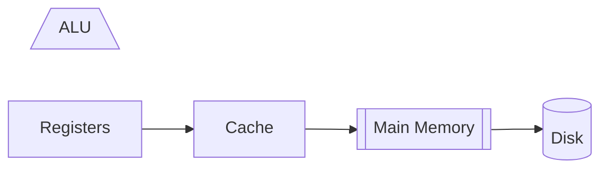

## Overview
### Machine Language
The Program executed by the machine is stored in RAM

- Operations
	- Operations are stored as binary codes
- Program Counter
	- Execution order is tracked by a Program Counter
- Addressing
	- The data to perform operation on is addresed

#### Mnemonics
Machine languages are stored as binary codes.
Binary codes can be translated into **Instruction codes**, that are more human readable.

Component
- Operation Code
- Target Codes (Registers)

### Assembly Language
An **Assembler** translates human readable **Assembly Language** (instruction codes) into binary machine language.

#### Symbols
```
ADD 1, Mem[129]

// The memory location can be substitude by a name

ADD 1, index
```

## Elements
Machine language is a specification of Hardware/Software Interface
- Operations
- Targets
- ..
### Machine Operations
- Usually correspond to what's implemented in Hardware
	- Arithemetic Operations: add, sub...
	- Logical Operations: and, or...
	- Flow Control: goto (instruction X), if then
- Difference between machine languages
	- Richness of functionality differrence (hardware division)
	- Data types (bit-width, floating point...)

### Memory Hierarchy
- Accessing a memory location is expensive
	- Address is large
	- Getting the memory content into CPU consumes time

Memory Hierarchy comes to handle these problems:
From fast to slow:


#### Registers
CPUs contain a few, easily accessed registers, 
Their number and functions are a central part of the Machine Language

- Data Registers
- Address Registers: Specifying addresses in larger memories


### Addressing Modes
- Register
	- `ADD R1, R2` -> `R2 = R2 + R1`
- Direct
	- `ADD R1, M[200]` -> `Mem[200] = Mem[200] + R1`
- Indirect
	- `ADD R1, @A` -> `Mem[A] = Mem[A] + R1`
	- `@A` is an address stored in a register
- Immediate
	- `ADD 73, R1` -> `R1 = R1 + 73`

### Input / Output
- Need Software "Drivers" as protocols for the CPU to control the devices
- Memory mapping: Memory Location holds input of device, etc

### Flow Control
Usualy the CPU executes machine instructions **in sequence**

**Unconditional Jumps**
Sometimes we need to *jump* unconditionally to another location
	- Loop
```Assembly
101   Load R1, 0
102   Add 1, R1
103   ...
...
156   Jump 102

// Giving the loop a name:

      Load R1, 0
loop: Add 1, R1
      ...
      // Do something
      ...
      Jump loop
```

**Conditional Jumps**
```Assembly
// We need absolute value
      JGT R1, 0, cont    // Jump to cont if R1 > 0
      Subtract R1, 0, R1 // R1 <- (0 - R1)
cont: ...
```