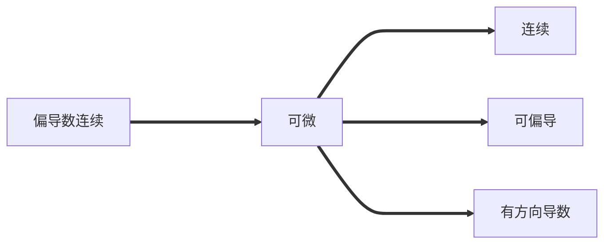

---
tags:
  - Math
  - Calculus-II
---
8.4 全微分
===
同一元函数的微分, 需要讨论函数增量的线性主部, 从而给出全微分的定义
## 全微分的概念
设函数 $z=f(x,y)$ 在 $P_0\,(x_0,y_0)$ 的某邻域有定义, 若它在该点处的**全增量**$$\Delta z = f(x_0+\Delta x,y_0+\Delta y)-f(x_0,y_0)$$
可以表示为$$\Delta z = A\cdot \Delta x+ B\cdot \Delta y+o(\rho)$$
其中 $A, B$ 为与 $\Delta x, \Delta y$ 无关的常数, $\rho = \displaystyle\sqrt{(\Delta x)^2+(\Delta y)^2}$, 则称 $A\cdot \Delta x+ B\cdot \Delta y$ 为函数 $f$ 在点 $P_0\,(x_0,y_0)$ 处的**全微分**, 即
$$\mathrm dz\bigg|_{(x_0,y_0)} = \mathrm df\bigg|_{(x_0,y_0)} = A\cdot \Delta x+ B\cdot \Delta y$$

由于 $o(\rho)$ 为 $(\Delta x, \Delta y)\to (0,0)$ 时的无穷小,
全微分是函数在某一点处全增量 $\Delta z$ 关于 $\Delta x, \Delta y$ 的线性近似

> 证明: 拉格朗日补项
### 可微必连续
若函数 $z=f(x,y)$ 在点 $(x_0,y_0)$ 可微, 则$$\lim_{\Delta x \rightarrow 0 \atop \Delta y \rightarrow 0}\Delta z = 0$$
即在该点处连续.

**二元函数连续是其可微的必要条件**
## 可微与可偏导的关系

### 可微必可偏导
若函数 $z=f(x,y)$ 在点 $(x_0,y_0)$ 可微, 即有
$$\Delta z = A\cdot \Delta x+ B\cdot \Delta y+o(\rho)$$
则函数 $f$ 在点 $(x_0,y_0)$ 的两个偏导数均存在, 且
$$A = f_x(x_0,y_0),B = f_y(x_0,y_0)$$

规定微分为 $\mathrm dx=\Delta x, \mathrm dy = \Delta y$, 函数在 $(x_0,y_0)$ 的全微分为
$$\mathrm dz\bigg|_{(x_0,y_0)} =f_x(x_0,y_0)\,\mathrm dx+f_y(x_0,y_0)\,\mathrm dy$$

若函数 $f$ 在区域 $D$ 每一点都可微, 则称 $f$ 是 $D$ 内的**可微函数**
$$\mathrm dz =f_x(x,y)\,\mathrm dx+f_y(x,y)\,\mathrm dy$$
### 偏导连续则函数可微
若函数 $z=f(x, y)$ 的两个一阶偏导数在 $(x_0, y_0)$ 连续, 则它在该点是可微的

## 全微分的几何意义
### 平面近似
全微分为全增量的线性近似,
$$\mathrm dz=f_x(x_0,y_0)\cdot \Delta x + f_y(x_0,y_0)\cdot \Delta y$$
当 $\Delta x, \Delta y$ 充分小, 有 $\Delta z\approx \mathrm d z$, 可得
**全微分的近似计算公式**
$$f(x, y)\approx f(x_0, y_0) + f_x(x_0, y_0)\cdot (x- x_0) + f_y(x_0, y_0)\cdot (y-y_0)$$

从几何上, 令 $z_0=f(x_0,y_0)$, 则曲面 $S:z=f(x,y)$ 可以在 $M_0(x_0,y_0,z_0)$ 点用平面近似
$$\pi:z=z_0+f_x(x_0, y_0)\cdot (x- x_0) + f_y(x_0, y_0)\cdot (y-y_0)$$
### 切平面
偏导数在平面 $y=y_0$ 和 $x=x_0$ 确定的两条切线
$$l_1:\begin{cases}z-z_0 = f_x(x_0,y_0)\cdot (x-x_0\\y=y_0)\end{cases}\qquad l_2:\begin{cases}z-z_0 = f_y(x_0,y_0)\cdot (y-y_0)\\x=x_0\end{cases}$$

这两条切线确定了曲线在该点的**切平面** $\pi$

